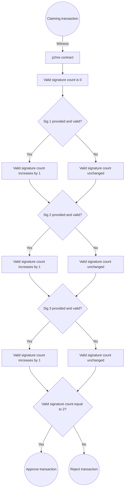
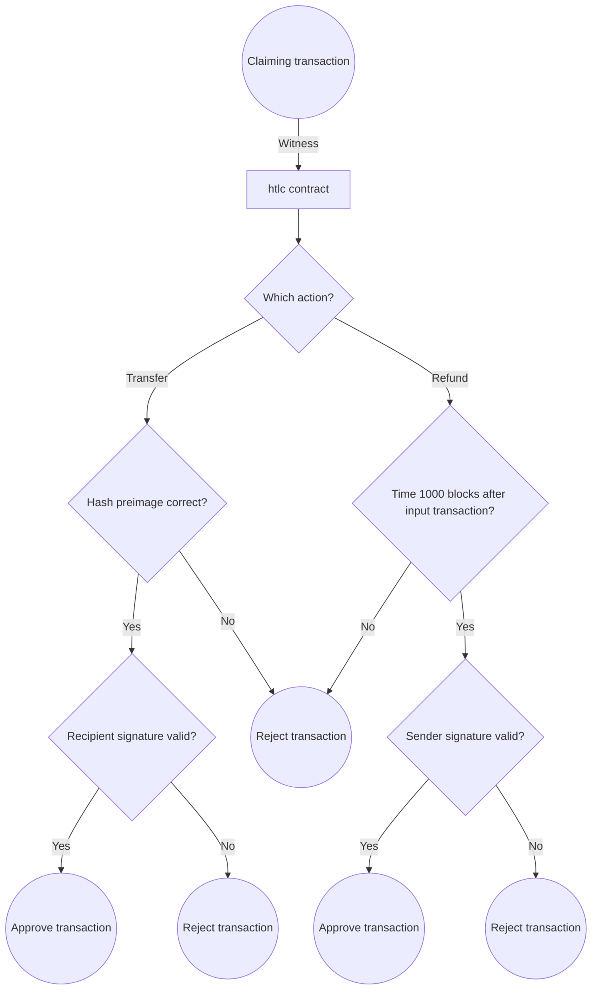
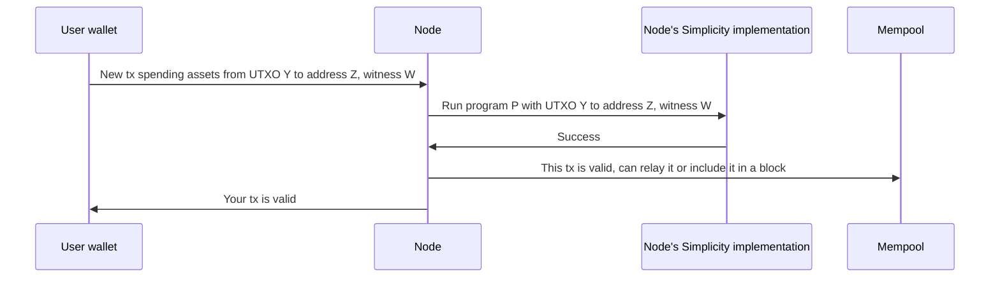
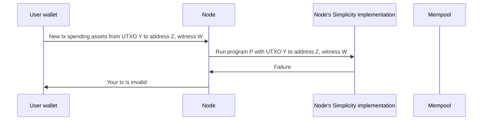

# On-chain Simplicity execution model

Simplicity is a special-purpose language. It works in the context of the Bitcoin transaction model on Bitcoin-like blockchains. This is sometimes also called the "<glossary:UTXO> model." If you're already familiar with Bitcoin Script and the role it plays in the logic of Bitcoin transactions, you can think of Simplicity as a more expressive alternative to Bitcoin Script, useful for writing more complex conditions (such as recursive <glossary:covenant>s that can propagate conditions across multiple subsequent transactions).

This document will describe the context in which Simplicity programs run, and what they can and can't do as a result.

## What Simplicity programs are used for

The basic task of every Simplicity program is to *consider a proposed blockchain transaction* and determine whether to *approve or disapprove* that transaction. More complex financial logic can be built out of one or more Simplicity programs working together to manage assets and their disposition across multiple related transactions. Together, we can call the logic and rules governing a set of related blockchain transactions a <glossary:smart contract>.

Designing a smart contract with Simplicity thus includes representing its logic as a series of on-chain transactions, and describing the rules that govern exactly when each transaction is permitted to occur.

## Where and how Simplicity programs run

Like Bitcoin Script scripts, Simplicity programs are *attached to <glossary:UTXO>s* and define spending conditions for the UTXOs to which they are attached. A Simplicity program can, however, have more complex logic and functionality compared to a Bitcoin Script script.

The ultimate task of a Simplicity program is always to *approve or disapprove a proposed transaction*. The Simplicity program does not initiate or originate the transaction and does not decide anything about what the transaction should be (for instance, it does not calculate or choose destination addresses, although it can *constrain* them by rejecting transactions that specify inappropriate destinations).

Contract functionality must ultimately be *expressed in terms of approving or disapproving transactions*. In Bitcoin and related systems, anyone can propose any transaction at any time; the spending conditions associated with assets, such as those contained in the logic of a Simplicity program, form part of the rules that determine whether or not proposed transactions are valid and hence whether those transactions could eventually be recorded in a block and become part of the blockchain.

So, whenever a <glossary:node> examines a transaction involving UTXO controlled by a Simplicity program, the node will run that program to confirm that the program agrees to allow the transaction.

The information available to the program to use in making that decision consists of

* whatever details are hard-coded within the program (for example, trusted public key values),
* details of all the <glossary:input>s and <glossary:output>s of the proposed transaction, and
* <glossary:witness> data supplied by the creator of the transaction as input to the program.

Note that the program can directly check its own cryptographic identity by examining the input UTXO to which it was attached.

The <glossary:witness> supplied as part of the transaction by its creator represents inputs meant to provide additional context for the transaction. The form of the expected witness is determined in advance by the contract; a witness might include information such as

* choices among different options or contract features (for example, which of several possible actions the transaction is requesting to take)
* values of specific parameters (for example, an amount)
* asserted state from parties' prior interactions with the contract (see <a href="state">State Management in SimplicityHL</a> for more details)
* digital signatures from parties approving the contract or confirming other relevant statements (for example, a party's signatures approving the exercise of some ability under the contract, or an oracle's signature asserting the truth of some off-chain fact such as a market price or whether a specific event has occurred)

The [Witnesses in SimplicityHL development](./witness) document talks about the practical mechanics of creating the witness.

Because Simplicity is formally specified and fully deterministic, every node that examines that transaction will come to exactly the same conclusion about what the result of running the Simplicity program was, without ambiguity.

## How Simplicity programs are triggered or invoked

As noted in the previous section, Simplicity programs can't initiate transactions; indeed, they can't run at all unless someone proposes a transaction by constructing the transaction and submitting it to a node. (For development purposes, you can also run a Simplicity program locally with `hal-simplicity simplicity pset run` after building a <glossary:PSET> representing the overall transaction within which the program will run. This simulates the Simplicity logic that a node would follow, although nodes can also reject transactions for various other reasons, such as if the input UTXO has already been spent, if sufficient fees are not paid with the transaction, or if spending conditions applicable to some other referenced UTXO are not satisfied.)

This means that Simplicity programs work in reaction to requests by other software requesting transactions that can be said to "advance" the contract state. Smart contract functionality programmed in Simplicity is invoked by user software, typically wallets or specialized client software, which is aware that a contract exists and takes actions to interact with it. <!-- We might want to mention the special case of causing a contract to exist in the first place. This is hard to talk about in terms of the metaphysics of when particular contracts can be said to exist for different purposes. --> For instance, if a Simplicity contract represents an agreement to exchange certain assets between two different users, typically each user's wallet software will generate and submit transactions to exercise that contract's functionality, thereby performing the roles that the contract assigns to each party. The contract's role is then to confirm that each party's software has performed permitted actions.

Client software must thus be aware of what a contract "expects" in order to generate appropriate transactions at appropriate times. This is similar to the ability of traditional wallet software to recognize when a user is allowed to spend on-chain assets. It can be more complex, however, because the client software may need to keep track of some state and sequence information, as well as providing a user interface to a human user to explain what state the contract is in and what contract-related actions the user is permitted to take. In some cases the contract may permit a user to elect several different actions, such as spending or refunding a token, or continuing or cancelling some trade. The client software must understand the available choices and help the user take actions by submitting appropriate on-chain transactions corresponding to the user's decision.

<!--
Overall, a contract can be thought of as possessing a *state machine*, like a flowchart, representing the logical states it can be put into by appropriate sequences of transactions.
-->

At the end of this document, we present several examples of applications of SimplicityHL and describe how the contracts they implement must be "driven" by some kind of end-user software generating and submitting appropriate transactions.

## Distinctive features of Simplicity and its environment

Simplicity is a deterministic functional programming environment. Simplicity programs <a href="https://delvingbitcoin.org/t/delving-simplicity-part-two-side-effects/2091">don't have access to any form of I/O or network access</a>. They can't display a user interface, read or write files, or call network APIs. In fact, they don't even have direct access to the data of the blockchains with which they are integrated. However, Simplicity does provide programs with the ability to *introspect* the currently-proposed transaction in order to find out details related to input and output asset types, amounts, and addresses. For example, a program can use <glossary:introspection> to require that an asset is sent back to a copy of that same program; it does so by approving only transactions where an output with exactly the same program code receives the asset that was spent in the program's input.

Simplicity programs also have access to a *<glossary:witness>*, a set of input data provided by the creator of a proposed transaction, which can help the programs decide whether the transaction is valid. Most, though not all, programs will check cryptographic information derived from the witness, such as whether one or more digital signatures included within the witness data are valid.

Whenever a user proposes a transaction that would spend (consume as input) an existing UTXO to which a Simplicity program is attached, the proposed transaction can make a claim that the Simplicity program authorizes that UTXO to be spent in the indicated context. Any node verifying the validity of the transaction will run the Simplicity program and be able to see whether this claim is correct (whether that program, when run in that context, did in fact approve that transaction). Because Simplicity is fully specified and deterministic, all nodes can agree about the result.

A Simplicity program can include several alternative paths reflecting different scenarios or outcomes, and different criteria for approving each one. A simple example is a timeout branch, where assets controlled by the program can be refunded to their original senders, but only after a certain amount of time has elapsed. This can serve as an alternative to the originally intended outcome in which a certain transaction is completed by transferring assets elsewhere, preventing assets from being stuck inside the contract if some party fails to perform its role.

## Why not perform more complex computations in Simplicity?

Every Simplicity program is run (albeit in pruned form) by *every node* that validates a block containing a transaction spending assets controlled by the program. The computation to validate transactions is expensive; indeed, creators of transactions may be required to pay for it indirectly via fees.

Simplicity programs perform deterministic computations based on publicly-disclosed information. It is useful to have nodes perform computation to validate compliance with financial logic and contractual rules (that determine who is entitled to specific assets). However, computation that isn't necessary for these purposes doesn't need to be done on-chain and replicated by all validators.

For example, a loan might charge interest at a specified rate. It is possible to compute how the loan balance will increase or decrease over time based on different hypothetical repayment schedules. In principle, a Simplicity program could compute those details in advance, but it doesn't *need* to make such hypothetical future projections in order to calculate the actual loan balance. It also wouldn't be able to output the results of these computations for anyone to see them. The same information can just as easily be computed by client-side software, and this is much more efficient. That computation can be done just once, on the device of the interested user.

In general, anything that doesn't have to happen on-chain should be handled outside of a Simplicity program. That includes any logic or computations that are relevant to user interface for the contract but not critical to its underlying financial logic and disposition of assets.

## Examples

Below, we discuss the functionality of three kinds of contracts in order to illustrate how Simplicity programs can make decisions in order to determine whether to approve proposed transactions.

These examples do not use introspection features, so they don't demonstrate Simplicity's ability to constrain outputs' destinations. Introspection would also provide an alternative way to implement the refund path in the `htlc` contract (constraining the refund payment to be sent to the address of the original sender of an asset, by asserting that an input address and output address match); this version instead hardcodes a key that can be used to authorize refunds, sent to any chosen address.

### p2ms

This program, `p2ms.simf`, is taken from the SimplicityHL examples collection. Our <a href="/getting-started/quickstart">quickstart</a> guide provides a recipe for making a Liquid Testnet transaction using this program.

```rust
/*
 * PAY TO MULTISIG
 *
 * The coins move if 2 of 3 people agree to move them. These people provide
 * their signatures, of which exactly 2 are required.
 *
 * https://docs.ivylang.org/bitcoin/language/ExampleContracts.html#lockwithmultisig
 */
fn not(bit: bool) -> bool {
    <u1>::into(jet::complement_1(<bool>::into(bit)))
}

fn checksig(pk: Pubkey, sig: Signature) {
    let msg: u256 = jet::sig_all_hash();
    jet::bip_0340_verify((pk, msg), sig);
}

fn checksig_add(counter: u8, pk: Pubkey, maybe_sig: Option<Signature>) -> u8 {
    match maybe_sig {
        Some(sig: Signature) => {
            checksig(pk, sig);
            let (carry, new_counter): (bool, u8) = jet::increment_8(counter);
            assert!(not(carry));
            new_counter
        }
        None => counter,
    }
}

fn check2of3multisig(pks: [Pubkey; 3], maybe_sigs: [Option<Signature>; 3]) {
    let [pk1, pk2, pk3]: [Pubkey; 3] = pks;
    let [sig1, sig2, sig3]: [Option<Signature>; 3] = maybe_sigs;

    let counter1: u8 = checksig_add(0, pk1, sig1);
    let counter2: u8 = checksig_add(counter1, pk2, sig2);
    let counter3: u8 = checksig_add(counter2, pk3, sig3);

    let threshold: u8 = 2;
    assert!(jet::eq_8(counter3, threshold));
}

fn main() {
    let pks: [Pubkey; 3] = [
        0x79be667ef9dcbbac55a06295ce870b07029bfcdb2dce28d959f2815b16f81798, // 1 * G
        0xc6047f9441ed7d6d3045406e95c07cd85c778e4b8cef3ca7abac09b95c709ee5, // 2 * G
        0xf9308a019258c31049344f85f89d5229b531c845836f99b08601f113bce036f9, // 3 * G
    ];
    check2of3multisig(pks, witness::MAYBE_SIGS);
}
```

This program includes three hard-coded public keys. Its logic says that any proposed transaction will be approved if, and only if, exactly two digital signatures on the proposed transaction are provided and those signatures were correctly made by the private keys corresponding to any two of those three keys.

Since the signatures are made over the transaction data including the specific input(s) and output(s), it can be presumed that the holders of those keys agree with transferring specific assets controlled by the contract to those specific destinations.

Once an asset has been sent to this contract (that is, a UTXO identifies it as a spending condition), anyone can propose a transaction that would spend that asset. The contract examines the proposed transaction and decides whether it does or does not contain sufficient evidence (based on the presence or absence of valid signatures provided in the witness). It then approves or rejects the transaction on that basis.



### htlc

This program, `htlc.simf`, is also taken from the SimplicityHL examples collection. It implements a hash-timelock contract, a mechanism often used in cryptocurrency swaps.

```rust
/*
 * HTLC (Hash Time-Locked Contract)
 *
 * The recipient can spend the coins by providing the secret preimage of a hash.
 * The sender can cancel the transfer after a fixed block height.
 *
 * HTLCs enable two-way payment channels and multi-hop payments,
 * such as on the Lightning network.
 *
 * https://docs.ivylang.org/bitcoin/language/ExampleContracts.html#htlc
 */
fn sha2(string: u256) -> u256 {
    let hasher: Ctx8 = jet::sha_256_ctx_8_init();
    let hasher: Ctx8 = jet::sha_256_ctx_8_add_32(hasher, string);
    jet::sha_256_ctx_8_finalize(hasher)
}

fn checksig(pk: Pubkey, sig: Signature) {
    let msg: u256 = jet::sig_all_hash();
    jet::bip_0340_verify((pk, msg), sig);
}

fn complete_spend(preimage: u256, recipient_sig: Signature) {
    let hash: u256 = sha2(preimage);
    let expected_hash: u256 = 0x66687aadf862bd776c8fc18b8e9f8e20089714856ee233b3902a591d0d5f2925; // sha2([0x00; 32])
    assert!(jet::eq_256(hash, expected_hash));
    let recipient_pk: Pubkey = 0x79be667ef9dcbbac55a06295ce870b07029bfcdb2dce28d959f2815b16f81798; // 1 * G
    checksig(recipient_pk, recipient_sig);
}

fn cancel_spend(sender_sig: Signature) {
    let timeout: Height = 1000;
    jet::check_lock_height(timeout);
    let sender_pk: Pubkey = 0xc6047f9441ed7d6d3045406e95c07cd85c778e4b8cef3ca7abac09b95c709ee5; // 2 * G
    checksig(sender_pk, sender_sig)
}

fn main() {
    match witness::COMPLETE_OR_CANCEL {
        Left(preimage_sig: (u256, Signature)) => {
            let (preimage, recipient_sig): (u256, Signature) = preimage_sig;
            complete_spend(preimage, recipient_sig);
        },
        Right(sender_sig: Signature) => cancel_spend(sender_sig),
    }
}
```

This program incorporates logic supporting two different outcomes, which are two different kinds of transactions that can potentially be approved in different circumstances. One path is called "complete" and represents a transaction that claims to complete the intended asset transfer. If the contract is satisfied (by someone revealing an appropriate hash preimage as "password") that this can occur, it will approve a transaction that effectuates this transfer. The authorized recipient must also provide a digital signature approving this transaction.

On the other hand, if the underlying asset being transferred is still controlled by the contract after a specified delay (here, of 1000 blocks since the receipt of the asset), the authenticated original sender can request a refund, and the contract will approve a transaction that effectuates the refund.

In each of these cases, the appropriate party must actively make a claim (by submitting a transaction indicating that the asset controlled by the contract ought to be tranferred) and must substantiate its claim by providing a <glossary:witness> successfully proving that all the required conditions are met. That is, the recipient of either path must explicit create and submit a transaction claiming an asset from the contract; until and unless this happens, the assets will continue to be controlled by the contract.

It's also worth noting that the contract does not store any kind of state to record whether one or the other paths has already previously been taken. The reason that one path excludes the other is simply that the underlying asset will already have been spent. In this case, the blockchain's transaction validity logic forbids double-spending the same <glossary:UTXO>. Another way of thinking of this is that, after the asset has been claimed from the contract by someone, the contract no longer controls the disposition of that asset, and therefore it is no longer interesting or relevant whether the contract would "agree" to some other transfer. In a certain sense, Simplicity contracts do not "know" what assets they control, but that information is readily available on the blockchain for inspection by software like wallet apps.



### Prediction market

This example discusses a prediction market contract but does not provide an example of SimplicityHL code for this contract.

A prediction market contract provides an example of how Simplicity contract updates are "driven" by some kind of end-user software such as a wallet or a contract-specific app, which must generate and submit appropriate transactions and witness data under appropriate circumstances. 

A typical prediction market issues pairs of tokens called YES and NO with respect to a specific question. The market has functionality that tends to ensure that the YES and NO prices remain consistent with one another.

The implementing contract usually provides the following actions:

* Issue pair: lock $1 with the contract; receive new YES and NO tokens
* Redeem pair: burn existing YES and NO tokens; receive locked $1
* Claim YES: burn existing YES token, provide oracle statement asserting that question resolved YES; receive locked $1
* Claim NO: burn existing NO token, provide oracle statement asserting that question resolved NO; receive locked $1

Users can also directly trade YES and NO tokens with one another, allowing their prices to vary from the assumed "indifference" level of $0.50.

At least the final three actions will likely need to be provided by different code paths of the same program, because they all need to be able to release (authorize spending of) some $1 of locked value, and assets controlled by the prediction market ought to be fungible.

If the underlying question resolves as YES, the YES token will typically be worth one currency unit (such as $1), while the NO token will not be redeemable for any value. Conversely, if the underlying question resolves as NO, the NO token will be redeemable for $1 and the YES token will not be redeemable. When the question resolves (by the issuance of a signed <glossary:oracle> statement indicating which side has won), each "winner" holding a token for the successful position on the question must individually proactively claim a reward by explicitly submitting a transaction that claims $1 from the contract in exchange for consuming a token. Therefore, all of the winners need to have, and use, software capable of formulating this claim transaction in order to receive any benefit from their successful bets in the market. In the absence of a specific claim transaction, the contract does not have any inherent notion of who the winners are or the fact that they have won or are entitled to anything. Some implementations may not even "remember" which side has won, and have to reminded by resubmitting the oracle statement together with each successive claim.





