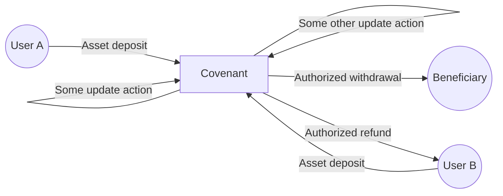
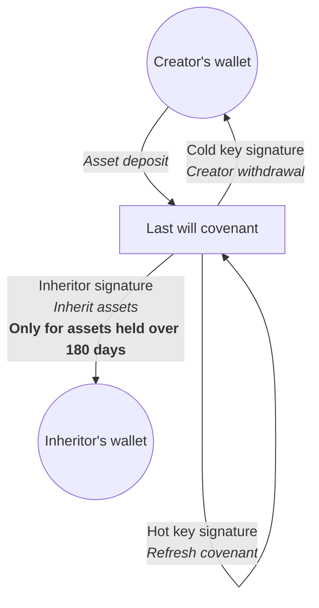
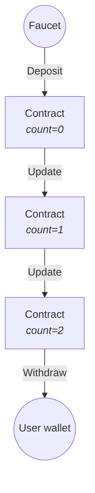

# Covenants and state management

This document describes concepts and features for enforcing complex financial logic in a Simplicity *covenant* that manages assets across a series of multiple transactions.

## Covenants

Some Simplicity contracts will be "finished" after a single transaction in which some party successfully claims the assets held by the contract. The <a href="https://github.com/BlockstreamResearch/SimplicityHL/blob/master/examples/htlc.simf">Hash Time-Locked Contract</a> is an example where the contract is complete as soon as an authorized party claims its underlying value.

However, a key feature of Simplicity is the ability to implement more complex financial logic by [introspection](../glossary.md#introspection). Introspection allows a [smart contact](../glossary.md#smart-contract) to enforce policies and relationships that last beyond a single transaction. This is usually done by means of [covenants](../glossary.md#covenant), smart contracts that enforce that assets are sent *back to a copy of the same contract*. This allows a contract to "hold onto" assets across a series of transactions, possibly moving some portion of those assets in or out of the contract, or updating the contract's state over time.




In Simplicity, most complex and long-term financial relationships among multiple parties will be modeled as covenants.

A simple example is provided in <a href="https://github.com/BlockstreamResearch/SimplicityHL/blob/master/examples/last_will.simf">`last_will.simf`</a>.

???+ "Click to hide source code"
    ```rust
    /*
     * LAST WILL
     *
     * The inheritor can spend the coins if the owner doesn't move the them for 180
     * days. The owner has to repeat the covenant when he moves the coins with his
     * hot key. The owner can break out of the covenant with his cold key.
     */
    fn checksig(pk: Pubkey, sig: Signature) {
        let msg: u256 = jet::sig_all_hash();
        jet::bip_0340_verify((pk, msg), sig);
    }
    
    // Enforce the covenant to repeat in the first output.
    //
    // Elements has explicit fee outputs, so enforce a fee output in the second output.
    // Disallow further outputs.
    fn recursive_covenant() {
        assert!(jet::eq_32(jet::num_outputs(), 2));
        let this_script_hash: u256 = jet::current_script_hash();
        let output_script_hash: u256 = unwrap(jet::output_script_hash(0));
        assert!(jet::eq_256(this_script_hash, output_script_hash));
        assert!(unwrap(jet::output_is_fee(1)));
    }

    fn inherit_spend(inheritor_sig: Signature) {
        let days_180: Distance = 25920;
        jet::check_lock_distance(days_180);
        let inheritor_pk: Pubkey = 0x79be667ef9dcbbac55a06295ce870b07029bfcdb2dce28d959f2815b16f81798; // 1 * G
        checksig(inheritor_pk, inheritor_sig);
    }

    fn cold_spend(cold_sig: Signature) {
        let cold_pk: Pubkey = 0xc6047f9441ed7d6d3045406e95c07cd85c778e4b8cef3ca7abac09b95c709ee5; // 2 * G
        checksig(cold_pk, cold_sig);
    }

    fn refresh_spend(hot_sig: Signature) {
        let hot_pk: Pubkey = 0xf9308a019258c31049344f85f89d5229b531c845836f99b08601f113bce036f9; // 3 * G
        checksig(hot_pk, hot_sig);
        recursive_covenant();
    }

    fn main() {
        match witness::INHERIT_OR_NOT {
            Left(inheritor_sig: Signature) => inherit_spend(inheritor_sig),
            Right(cold_or_hot: Either<Signature, Signature>) => match cold_or_hot {
                Left(cold_sig: Signature) => cold_spend(cold_sig),
                Right(hot_sig: Signature) => refresh_spend(hot_sig),
            },
        }
    }
    ```

This contract allows an heir to claim an inheritance (held by the contract) after the creator has died. It also enforces a mandatory time delay in the claim process so that the heir can only claim the inheritance when the creator hasn't "refreshed" the contract within the past 180 days.



The creator is expected to periodically refresh the contract by sending the contract's assets back to the same contract (via the **hot key**). Importantly, the "hot key" is restricted to authorizing this specific form of transaction: it can *only* authorize sending assets back to the same contract, not to any other destination. (This restriction on the hot key's power, the fact that it can't *remove* assets from the covenant's control, is the part of this example that uses covenant logic.)

The creator's more secure **cold key** isn't needed routinely, but can be used to authorize arbitrary withdrawals if the contract creator no longer wishes to keep certain assets stored inside the contract.

The inheritor's **inheritor key** can authorize arbitrary withdrawals from the contract, but only of [UTXO](../glossary.md#utxo)s that have been held by the contract for at least 180 days. So, whenever the creator refreshes the covenant with a hot key transaction, this period begins anew.

The covenant logic in `last_will.simf` is enforced by ensuring that a specific [output](../glossary.md#output) has a script hash matching the script hash of the [input](../glossary.md#input) from which the Simplicity program is being run. This is determined using the relevant [jet](../glossary.md#jet)s.

## SimplicityHL state management

The `last_will.simf` example above is **stateless**: it doesn't require the contract to actively remember anything. UTXOs' age is represented on the blockchain itself, and the contract automatically blocks the inheritor from transferring fresh UTXOs.

The <a href="execution-model">execution environment of a Simplicity program</a> is highly constrained; specifically, a Simplicity program can't perform any kind of input or output or network access, and can't even directly access earlier the contents of earlier transactions on the blockchain.

Still, complex contracts will often need to enforce multiple related transactions and "remember" facts and details over time. For example, they may need to record the existence or size of a debt, or record whether a certain action has already been taken. How can they do so in Simplicity's transaction-based architecture, without being able to save or load anything corresponding to files or database entries?

The recommended mechanism uses **cryptographic commitments**. These incorporate the state reference into the on-chain address of a copy of the Simplicity program itself, which the program can confirm by [introspection](../glossary.md#introspection) when it is run.

Effectively, this method generates an address for a program in a way that inherently incorporates a cryptographic reference to specific state; when that program is run, it can confirm that the state it was given via a [witness](../glossary.md#witness) matches the state that it expects to have according to its own address. It can immediately reject any proposed transactions that attempt to delete or tamper with the state.

This approach provides a way for a contract to maintain state (the values of specific variables) between one transaction and another transaction, enforcing a guarantee that the later transaction has access to the correct values of those variables and that no one has modified them. The contract does so by enforcing that outputs, including address references to versions of the same contract, contain cryptographic references to that state ("save"). A version of the same or a related contract can then enforce in a later transaction that suggested state provided to that new transaction matches up correctly with those cryptographic references ("load").

## Wallets maintain and assert state to contracts; cryptographic commitments confirm it

This means that the actual state data is not directly stored "inside of" the contract; the contract possesses a reliable way to *verify* state that is provided to it, but that state information is typically physically stored inside of a user's wallet software, and passed back to the contract whenever a new transaction involving the contract is constructed. Web developers may recognize this pattern as akin to digitally signed tokens (such as <a href="https://www.jwt.io/introduction#what-is-json-web-token">JWT</a>) provided by clients to web applications. In the web application setting, the physical storage of the state information can be offloaded to the client, and a digital signature proves that the client didn't modify its contents. The "client" (the wallet or other software that is constructing future transactions) similarly has the responsibility to store and provide the state information back to the contract, under a form of cryptographic authentication preventing modification, although the exact cryptographic details are different from the JWT analogy.

In the Simplicity context, the cryptographic commitment to the state is actually used as part of the contract's on-chain address, so performing a state update will actually mean deriving an updated address for the same contract (or a specifically chosen successor contract), and committing a transaction that forwards assets from the contract's prior address to the updated address. Those forwarded assets' spending conditions are then controlled by the updated version of the contract, which is cryptographically bound to the updated version of the state information.

To reiterate this point: whenever a [covenant](../glossary.md#covenant) performs a state update, it sends assets to a new copy of itself with a *different on-chain address* encoding a reference to the updated state data. A transaction can update state without moving any assets in or out of the contract, merely sending them to the new copy with the new address. Of course, client software meant to interact with the contract must be programmed to observe that this has happened so that new transactions are always performed with the most current updated copy.

Although wallet software should generally store contract state in order to provide it back to the contract when performing subsequent transactions, this information could be recalculated if necessary by examining blockchain history, because all Simplicity program execution is deterministic and based on public information. Thus, state information isn't generally confidential; locally replaying the evolution of a contract will ordinarily reveal what the expected state for the next transaction should be. (An initial state commitment when a copy of a program receives assets for the first time could require witness values that have not yet been publicly revealed anywhere, much as the code of the program may not have been publicly revealed. Storing state in a Merkle tree also optionally permits the state to be partially revealed as it is actually needed. For example, state of one branch of the program could be stored in one branch of the Merkle tree and state of another branch could be stored in another branch. The program could be designed so that the witness only reveals the part of the state that is actually used.)

## Basic state management mechanism

The modified address is calculated by storing a 256-bit state value in [Taproot](../glossary.md#taproot) alongside a commitment to the Simplicity program's code. Sample code to assert that input state is consistent with the program's address ("load"), and to assert that an output address is consistent with a commitment to a specific updated state value ("store") appears below. The `hal-simplicity simplicity pset update-input` command has also been updated with a `-s` flag that provides an input state value to the program; a copy should also be provided in the witness as `witness::STATE`.

The Rust version of this logic is found in <a href="https://github.com/BlockstreamResearch/simplicity-contracts/tree/main/crates/contracts/src/state_management/bytes32_tr_storage">`state_management/bytes32_tr_storage`</a>, including Rust code to build witnesses and transactions. This shows how a wallet can actually track and provide state back to the contract in a subsequent transaction.

Currently, this allows a program, if structured as a [covenant](../glossary.md#covenant), to pass itself state updates across subsequent transactions. The state information is always represented as a single uninterpreted `u256` integer value. This is conveniently the size of the output of a SHA256 hash, so a program can choose to interpret this value as a SHA256 hash of specified data items that are provided in a [witness](../glossary.md#witness), in a specific order. The program can then commit to specific values of these chosen data items between one transaction and the next. A more elegant approach would be interpreting this `u256` value as a reference to the root of a [Merkle tree](../glossary.md#merkle-tree).

A discussion and demonstration of this approach took place in <a href="https://youtu.be/ry2wQelP8Kc">the December 23, 2025 Simplicity Office Hours session</a>.

## Example with integer counter

This example contract, `third_time.simf`, uses the state management mechanism described in the prior section. It enforces the saying "the third time's the charm"; it requires a series of three distinct transactions in order to perform a withdrawal.

???+ "Click to hide source code"
    ```rust
    /*
    * "Third Time's The Charm" covenant demonstrating Simplicity state management 
    *
    * This covenant requires three transactions in a row in order to release the
    * locked coins. It counts how many of these transactions have been seen so
    * far using the witness::STATE value.
    *
    * State management:
    * Computes the "State Commitment" — the expected Script PubKey (address) 
    * for a specific state value.
    *
    * HOW IT WORKS:
    * In Simplicity/Liquid, state is not stored in a dedicated database. Instead, 
    * it is verified via a "Commitment Scheme" inside the Taproot tree of the UTXO.
    *
    * This function reconstructs the Taproot structure to validate that the provided 
    * witness data (state_data) was indeed cryptographically embedded into the 
    * transaction output that is currently being spent.
    *
    * LOGIC FLOW:
    * 1. Takes state_data (passed via witness at runtime).
    * 2. Hashes it as a non-executable TapData leaf.
    * 3. Combines it with the current program's CMR (tapleaf_hash).
    * 4. Derives the tweaked_key (Internal Key + Merkle Root).
    * 5. Returns the final SHA256 script hash (SegWit v1).
    *
    * USAGE:
    * - For load(), we verify: CalculatedHash(witness::STATE) == input_script_hash.
    * - For store(), we verify: CalculatedHash(updated_state) == output_script_hash.
    * - This assertion proves that the UTXO is "locked" not just by the code, 
    *   but specifically by THIS instance of the state data. So the on-chain address
    *   necessarily changes after each state-updating transaction in order to reflect
    *   a cryptographic commitment to the appropriate state data.
    *
    * Surrounding context tracks the state_data, interpreting its low 64 bits as
    * a counter. The counter can be updated by an "update" transaction sending
    * value back to the same contract. When the counter is equal to 2 or more,
    * the "withdraw" transaction is permitted, sending some or all value
    * to an arbitrary output address instead of back to the contract. Both the
    * "update" and "withdraw" transactions must include a valid signature by
    * the authorized key (here hardcoded in check_sig() for demonstration
    * purposes).
    *
    * When initially funding the contract, use witness::STATE = 0.
    */
    
    fn check_sig(sig: Signature) {
       let authorized_key: Pubkey = 0x79be667ef9dcbbac55a06295ce870b07029bfcdb2dce28d959f2815b16f81798; // 1 * G
       let msg: u256 = jet::sig_all_hash();
       jet::bip_0340_verify((authorized_key, msg), sig);
    }

    fn script_hash_for_input_script(state_data: u256) -> u256 {
        // This is the bulk of our "compute state commitment" logic from above.
        let tap_leaf: u256 = jet::tapleaf_hash();
        let state_ctx1: Ctx8 = jet::tapdata_init();
        let state_ctx2: Ctx8 = jet::sha_256_ctx_8_add_32(state_ctx1, state_data);
        let state_leaf: u256 = jet::sha_256_ctx_8_finalize(state_ctx2);
        let tap_node: u256 = jet::build_tapbranch(tap_leaf, state_leaf);
    
        // Compute a taptweak using this.
        let bip0341_key: u256 = 0x50929b74c1a04954b78b4b6035e97a5e078a5a0f28ec96d547bfee9ace803ac0;
        let tweaked_key: u256 = jet::build_taptweak(bip0341_key, tap_node);
        
        // Turn the taptweak into a script hash
        let hash_ctx1: Ctx8 = jet::sha_256_ctx_8_init();
        let hash_ctx2: Ctx8 = jet::sha_256_ctx_8_add_2(hash_ctx1, 0x5120); // Segwit v1, length 32
        let hash_ctx3: Ctx8 = jet::sha_256_ctx_8_add_32(hash_ctx2, tweaked_key);
        jet::sha_256_ctx_8_finalize(hash_ctx3)
    }

    fn load(state_data: u256) {
        // Assert that the input is correct, i.e. "load".
        assert!(jet::eq_256(
            script_hash_for_input_script(state_data),
            unwrap(jet::input_script_hash(jet::current_index()))
        ));
    }
    
    fn store(new_state: u256) {
        assert!(jet::eq_256(
            script_hash_for_input_script(new_state),
            unwrap(jet::output_script_hash(jet::current_index()))
        ));
    }

    fn update(sig: Signature, state_data: u256) {
       // In this case, if the signature is correct, we approve the transaction
       // if the destination is the same contract but with a correct internal
       // state update that increases the count by 1.

       // Check that the signature is correct.
       check_sig(sig);

       let (state1, state2, state3, count): (u64, u64, u64, u64) = <u256>::into(state_data);
       let (carry, new_count): (bool, u64) = jet::increment_64(count);

       // Check for overflow.
       assert!(jet::eq_1(<bool>::into(carry), 0));

       // Assert that the output is being sent to a correctly-updated copy of this
       // specific program, i.e. "store".
       let new_state: u256 = <(u64, u64, u64, u64)>::into((state1, state2, state3, new_count));
       store(new_state);

       // Assert that there are exactly two outputs in the currently-proposed
       // transaction (corresponding to the new contract and the network fee
       // payment). Without this logic, the updater could cause coins to leak out
       // of the covenant by sending some of the input value to an uncontrolled
       // output address that is not a copy of this contract. (Even with this
       // logic, the fee amount itself is not constrained here, and the updater
       // could choose to give away some or all of the stored value to miners in
       // the form of an excessive fee.)
       assert!(jet::eq_32(jet::num_outputs(), 2));
       assert!(unwrap(jet::output_is_fee(1)));
    }

    fn withdraw(sig: Signature, state_data: u256) {
        // In this case, if the signature is correct, and the count is already at
        // least 2, we approve the transaction (allowing the destination(s) and
        // amount(s) indicated by the proposer).

        // Check that the signature is correct.
        check_sig(sig);

        // Assert that the count from the provided state is already at least 2.
        let (_, _, _, count): (u64, u64, u64, u64) = <u256>::into(state_data);
        assert!(jet::le_64(2, count));
    }

    fn main() {
        // Assert that the provided state_data is correct according to this
        // program's cryptographic commitment.
        let state_data: u256 = witness::STATE;
        load(state_data);

        match witness::UPDATE_OR_WITHDRAW {
            Left(sig: Signature) => update(sig, state_data),
            Right(sig2: Signature) => withdraw(sig2, state_data),
        }
    }
    ```

The use of `jet::ge_8` means that one can update *at least* twice before a withdrawal. If this is replaced by `jet::eq_8`, the contract will enforce *exactly* two updates before a withdrawal.

As described earlier, each of the intermediate transactions will be sent to a **different on-chain address** representing a commitment to the same Simplicity covenant, but with different state. Thus, the `update` transactions in the diagram below each have corresponding distinct destination addresses.



### Constraining state updates

Contracts must include logic to ensure that only authorized parties can perform transactions that cause state updates. The contract above does this with `check_sig()`, requiring that all transactions be signed by an authorized party.

The `update()` function in this example enforces further constraints on outputs, such as constraining the total number of outputs to exactly two. The first output must be an updated version of the same contract, while the second output must be a network fee payment. Without this constraint, the updater could add an additional output that leaks contract funds to an unrelated address.

A real financial application may need to include logic to enforce a variety of further constraints. For example:

* The contract may be designed to deal with a specified [asset](../glossary.md#asset), such as LBTC. Since [Liquid](../glossary.md#liquid) supports a variety of assets, the contract should inspect the assets being transferred to confirm that they always of the expected kinds. In most contexts, payments should not be allowed to be made with arbitrary assets.
<!-- Let's figure out a clearer way to talk about this issue, as we don't have a concrete example relevant to it here, or a description of how this situation can arise:
* If the same contract controls several different UTXOs, it may need to enforce that *all* relevant value is transferred by certain actions, not just a portion of the value controlled by the contract.
-->
* The contract may need to constrain fee amounts in order to prevent parties from intentionally donating the contract's assets to miners via excessive fees. The contract may also require a party performing an update to pay the network fee. In that case, it must allow that party to provide a fee input in the transaction that covers the transaction fee, and may also allow the party to receive change from the fee input.

## Next steps

As noted above, a program can store multiple values by interpreting the commitment as a SHA256 hash, where the `load()` and `store()` routines verify that the hash value matches the hash calculated from all the relevant witness values. In this case, the contract developer will create a convention for exactly which values are hashed and in which order; that convention is then used whenever state is stored or loaded.

SimplicityHL will have library functions reflecting the `load` and `store` patterns to make it easier for developers to use these mechanisms without writing boilerplate referring to the lower-level details of the cryptographic state commitment. It will also offer a reference implementation of Merkle tree creation and verification to make it easier for developers to load and store multiple values in a standardized and elegant way.
