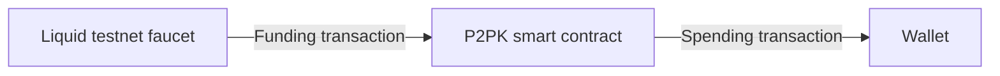

# SimplicityHL Quickstart

This is a quickstart document to help you perform your first [transaction](../glossary.md#transaction) on [Liquid](../glossary.md#liquid) testnet using a [Simplicity](../glossary.md#simplicity) [contract](../glossary.md#contract) with a Rust environment.

<a href="https://rust-lang.org/tools/install/">Make sure you have Rust installed.</a>

<!-- (There is also a <a href="bash-quickstart">`bash` version</a> of the quickstart available, which may be helpful for readers who are more familiar with `bash` than with Rust.) -->

## Demo walkthrough

### 1. Clone the walkthrough git repository

Clone the repository:

```bash
git clone https://github.com/BlockstreamResearch/simplicity-demo
cd simplicity-demo
```

This is a Rust project surrounding a SimplicityHL "Pay-to-Public-Key" (P2PK) smart contract. This smart contract lets anyone who has the matching private key claim the funds held by the contract. Its code (from `crates/simplicity-hl-core/src/source_simf_p2pk.simf`) looks like this:

```rust
fn main() {
    // Authorized public key (fixed at compile time)
    let pubkey: Pubkey = param::PUBLIC_KEY;

    // Signature value (provided at spend time)
    let signature: Signature = witness::SIGNATURE;

    // Sighash (summary of complete proposed transaction)
    let sighash: u256 = jet::sig_all_hash();

    // Verify supplied signature over proposed transaction details
    jet::bip_0340_verify((pubkey, sighash), signature);
}
```

This contract has a spot for a public key ("`param::PUBLIC_KEY`") of the person authorized to spend the contract's funds.

??? "Using your own wallet instead"
    If you prefer, you can generate a Liquid testnet wallet of your own and send the tLBTC from the contract to your own wallet instead. You can do this by installing `elementsd` and `elements-cli` and then generating a local wallet with `elements-cli`. Alternatively, you can install a wallet application with Liquid Network support like the <a href="https://blockstream.com/app/">Blockstream App</a>. In the latter case, you'll need to create a Liquid testnet wallet and account. You must provide an [unconfidential](../glossary.md#unconfidential) [address](../glossary.md#address) as the destination address here, not a [confidential](../glossary.md#confidential) address. The command `hal-simplicity address inspect` can derive the unconfidential equivalent of a confidential address if required.

### 2. Create a random seed for a public and private keypair

Generate a seed value for generating keys.

```bash
openssl rand -hex 32
```

??? "Alternative software options"
    If you don't have `openssl`, you can use one of these methods to generate a random seed value.

    On Unix-like systems:

    ```bash
    head -c 32 /dev/urandom | xxd -p -c 32
    ```

    On Windows (PowerShell):

    ```ps1
    $bytes = New-Object Byte[] 32
    (New-Object System.Security.Cryptography.RNGCryptoServiceProvider).GetBytes($bytes)
    [System.BitConverter]::ToString($bytes).Replace("-", "").ToLower()
    ```

Create an `.env.demo` file at the top level of the `simplicity-demo` project. Add a single line with `SEED_HEX=` followed by your random seed value.

### 3. Compile the P2PK contract using the public key

```bash
cargo run p2pk compile-to-testnet-address
```

This code:

* Derives a private and public keypair from the random seed
* Substitutes the public key into the `p2pk.simf` program
* Compiles the `p2pk.simf` program
* Derives a blockchain address from the compiled Simplicity program

The output will look something like this:

```
# Deriving keypair from seed.
# Deriving Liquid testnet address.
# Compiling SimplicityHL program source_simf/p2pk.simf.

SimplicityHL source code:
    fn main() {
        // Authorized public key (fixed at compile time)
        let pubkey: Pubkey = param::PUBLIC_KEY;

        // Signature value (provided at spend time)
        let signature: Signature = witness::SIGNATURE;

        // Sighash (summary of complete proposed transaction)
        let sighash: u256 = jet::sig_all_hash();

        // Verify supplied signature over proposed transaction details
        jet::bip_0340_verify((pubkey, sighash), signature);
    }

Parameter arguments (compile-time):
    mod param {
        const PUBLIC_KEY: u256 = 0x7c37...;
    }

Contract's Liquid testnet address: tex1...
```

The address derived at the bottom, beginning with `tex1...`, can be used to transfer coins to the contract.



### 4. Fund the contract on Liquid testnet

Use the Liquid testnet faucet to send some tLBTC (representing Bitcoin on [Liquid](../glossary.md#liquid) testnet) to this contract. Provide the address from the previous step.

```bash
cargo run p2pk fund-from-faucet --address tex1...
```

This funds the contract with 100000 sats of tLBTC. Now that the contract controls these coins, its logic decides if and when this value may be spent.

You'll see a transaction ID in the output reflecting the transaction that sent the coins from the faucet to the contract. This will be used in the next step in claiming the coins from the contract.

### 5. Create a transaction that spends the tLBTC

Now run this command to generate a transaction that spends the assets you sent to your contract (less a network fee of 100 sats).

Replace `<TXID>` with the transaction ID value from the prior step. The address `tex1q9hgs7pj8etd92rw5qz3dymvujffxzylmj6a28h` is a sample wallet address created to receive tLBTC funds from this process.

```bash
cargo run p2pk spend-from-p2pk-contract --utxo <TXID>:0 --to-address tex1q9hgs7pj8etd92rw5qz3dymvujffxzylmj6a28h --send-sats 99900 --fee-sats 100
```

You'll see output describing steps in the creation of the spending transaction. This transaction proves to the contract that you're entitled to spend the funds it controls.

??? "What's happening here?"
    This command creates a new Liquid testnet transaction whose [input](../glossary.md#input) comes from the prior contract-funding transaction and whose [output](../glossary.md#output), less a fee, goes to the specified destination address.

    The Rust program handles various steps in this process.

    * It derives the private key again (from the seed you created earlier).
    * It compiles the SimplicityHL program again to obtain all parameters associated with the compiled program.
    * It creates a [transaction](../glossary.md#transaction) proposing to transfer assets from the contract.
    * It signs the transaction with the private key, creating a digital signature.
    * It creates a [witness](../glossary.md#witness) including this digital signature.
    * It combines all of these elements into a single finalized transaction ready for submission to the blockchain.

    You'll see each of these steps as it happens, with output something like this:

    ```
    # Deriving keypair from seed.
    # Creating proposed transaction from UTXO to specified destination.
    Asset: (tLBTC)
    # Signing transaction with private key.
    # Compiling SimplicityHL program source_simf/p2pk.simf.

    SimplicityHL source code:
        fn main() {
            // Authorized public key (fixed at compile time)
            let pubkey: Pubkey = param::PUBLIC_KEY;

            // Signature value (provided at spend time)
            let signature: Signature = witness::SIGNATURE;

            // Sighash (summary of complete proposed transaction)
            let sighash: u256 = jet::sig_all_hash();

            // Verify supplied signature over proposed transaction details
            jet::bip_0340_verify((pubkey, sighash), signature);
        }

    Parameter arguments (compile-time):
        mod param {
            const PUBLIC_KEY: u256 = 0x7c37e620ca2a8e8ba67c7e18f9d9cc6ad53221b1dfbcbc75ba3900c7cea7d75b;
        }

    Witness values (spend-time):
        mod witness {
            const SIGNATURE: [u8; 64] = 0x6755724721a2ade83c21f1e89c67be1585cc397b0702719bcc58d2a8c5f7ca77ca32321cb22dd73637cff759b248b0c9f816a895478cbd4e77ba79ca86531929;
        }

    Transaction:
    020000000....
    ```

### 6. Submit the transaction to the Liquid testnet

Now run the prior command again with `--broadcast` to submit the transaction to the mempool for inclusion on the blockchain.

```bash
cargo run p2pk spend-from-p2pk-contract --utxo <TXID>:0 --to-address tex1q9hgs7pj8etd92rw5qz3dymvujffxzylmj6a28h --send-sats 99900 --fee-sats 100 --broadcast
```

(Again, `<TXID>` here should be replaced with the transaction ID from step 4.)

You can view your successful transaction <a href="https://blockstream.info/liquidtestnet/">on the Explorer</a>.

### Congratulations

You've just compiled a smart contract, sent assets to it on a public blockchain, and then satisfied the contract, allowing you to spend those assets.

??? "See more technical details"
    The `cargo run` commands above support a `-v` option for verbose output, which includes more technical details about the cryptographic parameters that were calculated by the Rust code. For example, this will display the [CMR](../glossary.md#cmr) and compiled program.

#### Next steps

* Check out <a href="https://github.com/BlockstreamResearch/simplicity-contracts">more complex example contracts</a> with similar demos.
* See <a href="https://github.com/BlockstreamResearch/SimplicityHL/tree/master/examples">simple contract source code</a> that demonstrates SimplicityHL language syntax and features.
* Read <a href="https://docs.simplicity-lang.org/documentation/execution-model/">SimplicityHL language documentation</a> to learn more about how to write smart contracts.
