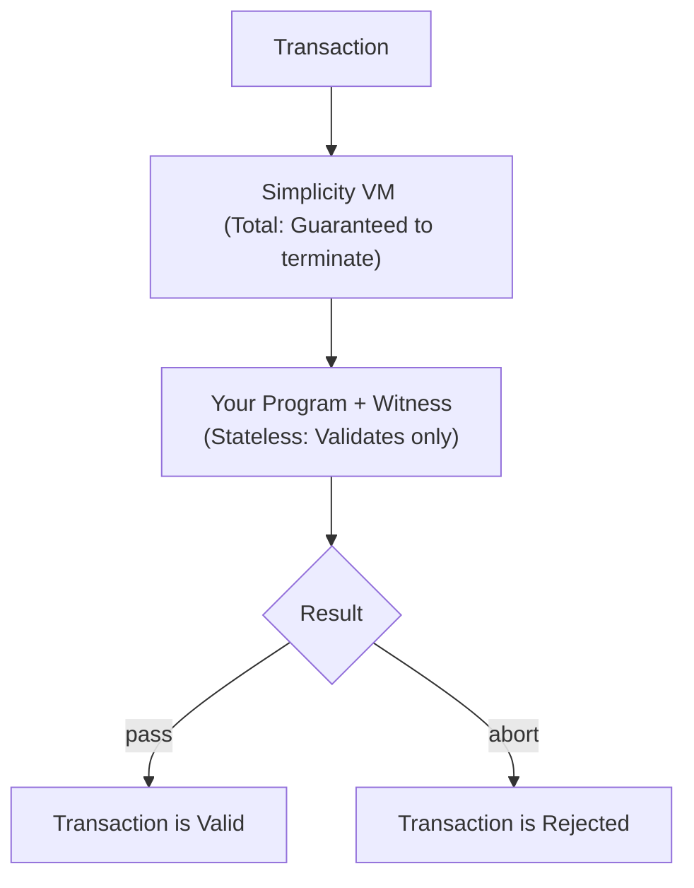

# Welcome to SimplicityHL

---

## Your First Contract

### Hello Simplicity

```rust
fn main() {
    // This contract always succeeds
}
```

**What this means:**

- Every contract has a `main()` function
- if `main()` does not abort, it is considered to have succeeded; you can think
  of "did the function reach its end" as an implicit boolean return
- No side effects other than aborts and read-only access to witness data and the transaction environment
  (no state)

### Compiling Contracts

SimplicityHL compiles to Simplicity bytecode through several stages:

**Code reference:** [`SimplicityHL/src/compile.rs`](https://github.com/BlockstreamResearch/SimplicityHL/blob/master/src/compile.rs)

1. **Parse** - Source code to AST
2. **Type Check** - Verify types are correct
3. **Translate** - AST to Simplicity combinators

**Result:** A Simplicity program, identified by its unique 32-byte Commitment Merkle Root (CMR).
See "What is the CMR?" below for more information.

---

## Understanding the Contract Model

### How Contracts Execute On-Chain



### Witness Data

**What is witness?**

Data provided when spending that the contract can access.

**Example:**
```rust
fn main() {
    let sig: Signature = witness::signature;
    // Use sig in validation
}
```

**Witness file format:**
```json
{
  "signature": {
    "value": "0x...",
    "type": "Signature"
  }
}
```

---

## SimplicityHL Reference

[Development Overview](../simplicityhl-reference/index.md)

- [Types and Values](../simplicityhl-reference/type.md)
- [Type Aliases](../simplicityhl-reference/type_alias.md)
- [Type Casting](../simplicityhl-reference/type_casting.md)
- [Let Statements](../simplicityhl-reference/let_statement.md)
- [Match Expression](../simplicityhl-reference/match_expression.md)
- [Functions](../simplicityhl-reference/function.md)
- [Programs](../simplicityhl-reference/program.md)
- [Context](../simplicityhl-reference/context.md)
- [Environment](../simplicityhl-reference/environment.md)
- [Translation](../simplicityhl-reference/translation.md)


---

## Jets - Built-in Operations

Jets are optimized implementations of common Simplicity expressions that replace expensive Simplicity code with efficient native implementations. They provide significant performance improvements while maintaining the safety and verifiability of Simplicity.

For detailed information about jets, their creation process, and available operations, see:
- [Jets Explained](../documentation/jets-explained.md) - What jets are and how they work
- [Jets Overview](../documentation/jets-overview.md) - Complete catalog of available jets

---

## Working with Transaction Data

SimplicityHL contracts have access to transaction data through introspection jets. For detailed information about:

- Available transaction data and jets
- Introspection operations
- Transaction environment access

See [How Simplicity Works](../documentation/how-simplicity-works.md#jets-and-their-weight-calculation) for the complete list of introspection jets and their capabilities.

---

## Understanding Commitment Merkle Roots (CMRs)

A CMR is a 32-byte hash that uniquely identifies your Simplicity program and serves as its on-chain representation. The CMR is deterministic and cryptographically binding, ensuring the same code always produces the same CMR.

For detailed information about CMRs, their properties, and how they're computed, see this section of [How Simplicity Works](../documentation/how-simplicity-works.md#contract-storage-and-integration-in-taproot).

---

## From Contract to Address

Simplicity contracts integrate with the Liquid Network through Taproot's tapleaf versioning system, allowing them to coexist with traditional Bitcoin Script on Liquid. The contract's CMR is combined with a provably unspendable internal key to create a P2TR address.

For detailed information about Taproot integration, address generation, and the construction process, see this section of [How Simplicity Works](../documentation/how-simplicity-works.md#contract-storage-and-integration-in-taproot).

---

## Sighash Explained

When spending a Simplicity contract, signatures commit to a sighash that includes transaction data, inputs, outputs, and the genesis hash for network identification. The SIGHASH_ALL sighash commits to the entire transaction, ensuring signatures are valid only for the specific transaction being signed.

For the `sig_all_hash` jet reference, see [Jets Overview](../documentation/jets-overview.md#bitcoin-specific-jets). For detailed sighash computation and signature handling, see the [CLI Guide](cli.md#understanding-sighash-internal-process) for practical examples.

---

## Cost and Resource Bounds

Simplicity programs have a maximum cost limit of 2^20 weight units, with cost calculated through static analysis before execution. The budget available depends on witness size, and programs may need padding to meet weight requirements if the witness is large.

For detailed information about cost calculation, weight limits, and resource bounds, see this section of [How Simplicity Works](../documentation/how-simplicity-works.md#jets-and-their-weight-calculation) for the complete explanation of weight calculation and cost functions..

---

## Development Tools

### Web IDE
For browser-based development, see the [Web IDE Guide](web-ide.md) for writing, compiling, and deploying contracts directly in your browser.

### CLI Tools
For command-line development workflows, see the [CLI Guide](cli.md) for local testing, building, and deployment.

