# Simplicity Web IDE Guide

## What is the Web IDE?

The Simplicity Web IDE is a browser-based development environment for writing, compiling, and deploying Simplicity contracts to Liquid testnet.

**Repository:** https://github.com/BlockstreamResearch/simplicity-webide  
**Live Demo:** (Deploy locally or access hosted instance)

**Features:**
- Write SimplicityHL contracts in browser
- Compile to Simplicity bytecode
- Generate P2TR addresses
- Build transactions
- Deploy to Liquid testnet
- No installation required

---

## Interface Overview

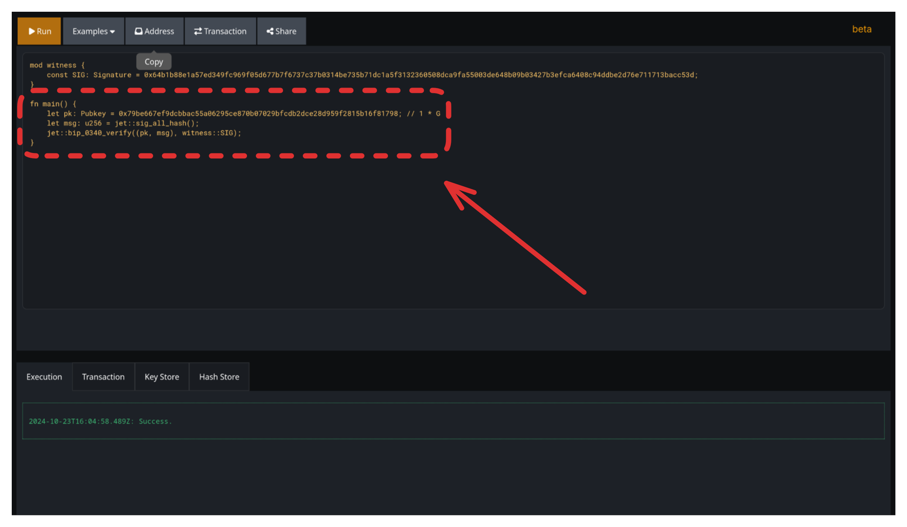

**Components:**

1. **Code Editor** (Left panel)
   - Syntax highlighting for SimplicityHL
   - Line numbers
   - Error highlighting

2. **Compiler Output** (Right panel)
   - Compilation status
   - CMR display
   - P2TR address
   - Error messages

3. **Transaction Builder** (Bottom panel)
   - Input UTXO details
   - Output configuration
   - Witness data entry
   - Build & broadcast buttons

4. **Network Selector** (Top bar)
   - Liquid Testnet (default)
   - Settings and options

---

## Getting Started

### Step 1: Open the Web IDE

Navigate to the Web IDE deployment in your browser.

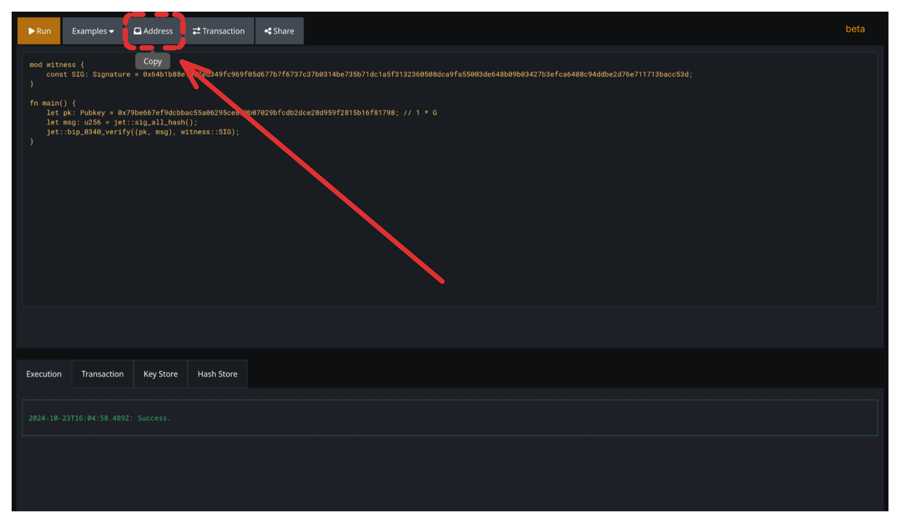

### Step 2: Write Your Contract

**Example - Simple Contract:**

```rust
fn main() {
    // This contract always succeeds
}
```

Click **Compile** button.

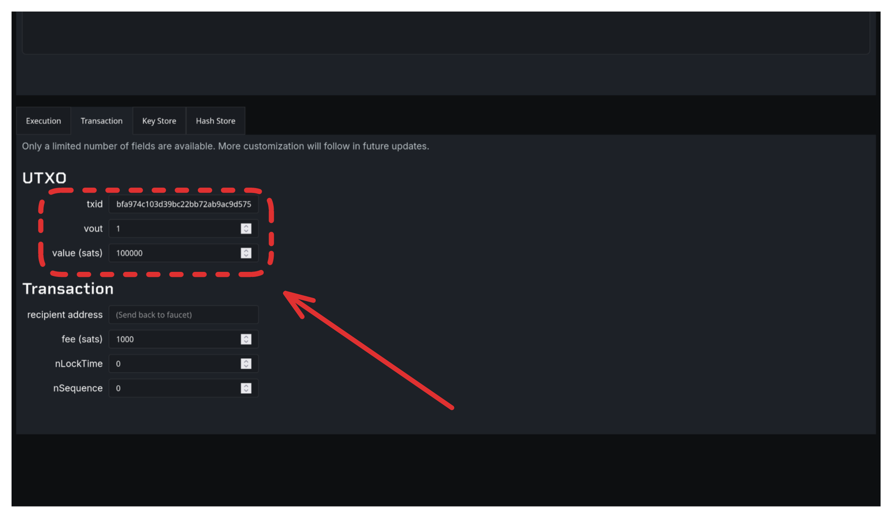

**Output shows:**
- CMR (Commitment Merkle Root)
- P2TR address
- Compilation success/errors

### Step 3: Generate Address

After compilation, the IDE displays the P2TR address and CMR.

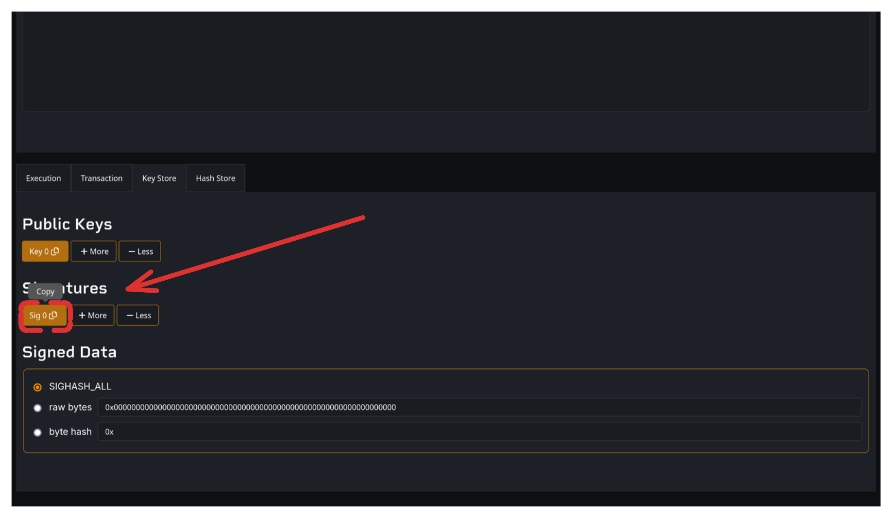

**What this means:**
- P2TR address: Where to send funds
- CMR: Unique identifier for this contract

Copy the P2TR address.

### Step 4: Fund the Address

**Option A: Use Faucet Website**

Navigate to: https://liquidtestnet.com/faucet

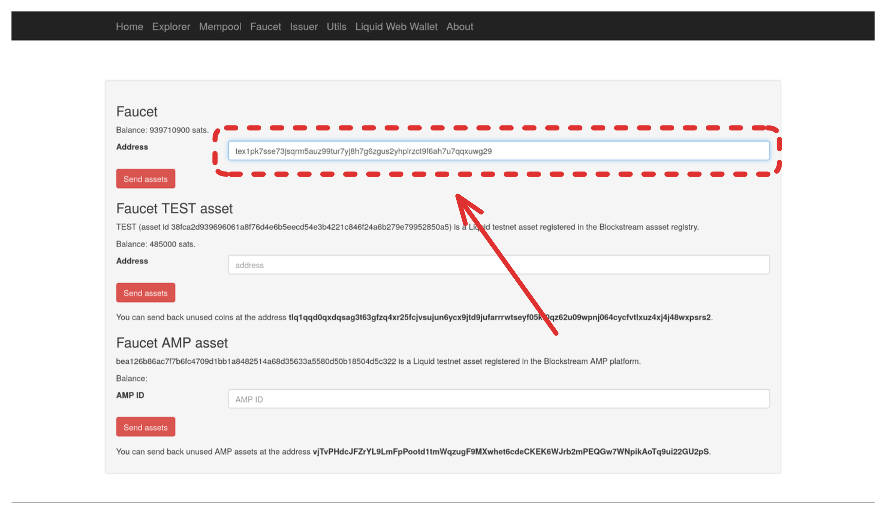

Paste your P2TR address and request L-BTC.

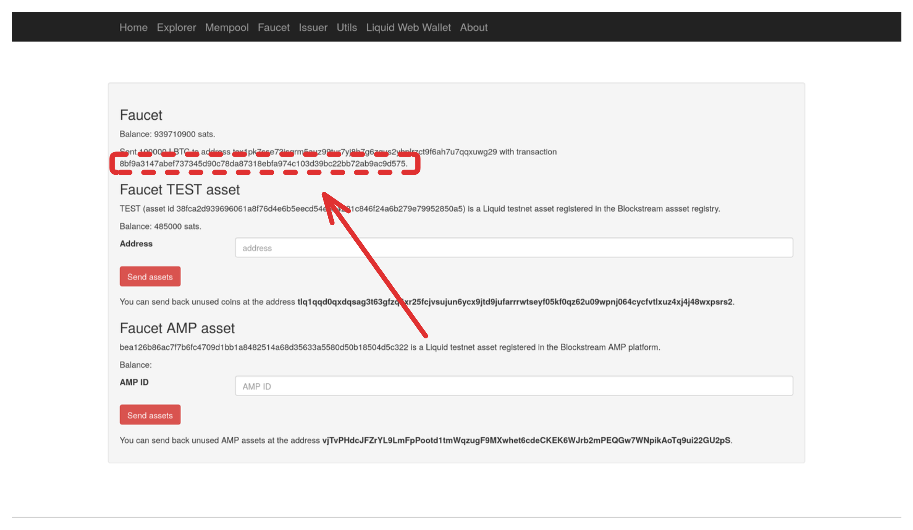

**Option B: Via API**
```bash
curl "https://liquidtestnet.com/faucet?address=tex1p...&action=lbtc"
```

Wait 60 seconds for confirmation.

### Step 5: Check Balance

Use the Blockstream explorer to verify: https://blockstream.info/liquidtestnet

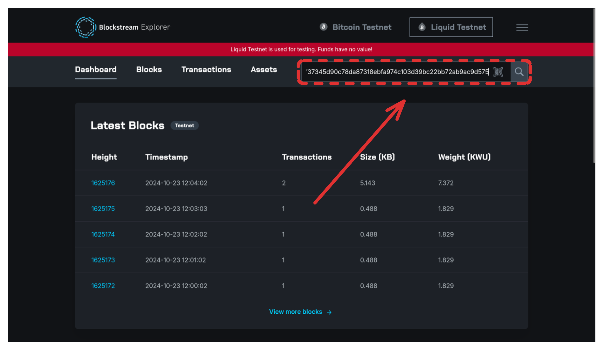

**Or via API:**
```bash
curl "https://blockstream.info/liquidtestnet/api/address/tex1p.../utxo"
```

**Response shows:**
```json
[{
  "txid": "abc123...",
  "vout": 0,
  "value": 100000
}]
```

Note the `txid` and `vout` - you'll need these for the transaction builder.

### Step 6: Enter Transaction Details

Scroll to the **Transaction** section in the Web IDE.


**Enter UTXO data from Step 5:**
1. **Txid:** Paste the funding transaction ID
2. **Vout:** Enter output index (usually `0` or `1`)
3. **Value:** Enter amount in sats (e.g., `100000`)

Leave destination and other fields as defaults for now.

### Step 7: Generate Signature (For P2PK Contracts)

**For contracts requiring signatures:**

Click the **"Sig 0"** button in the Web IDE.


**The signature is automatically copied to your clipboard!**

**Update your contract code:**

Paste the signature into your witness section:
```rust
mod witness {
    const SIGNATURE: Signature = 0xf74b3ca574647f8595624b129324afa2...;
}
```

**What this does:** The Web IDE computes the sighash and signs it with an internal key.

### Step 8: Build Transaction

Click the **"Transaction"** button.

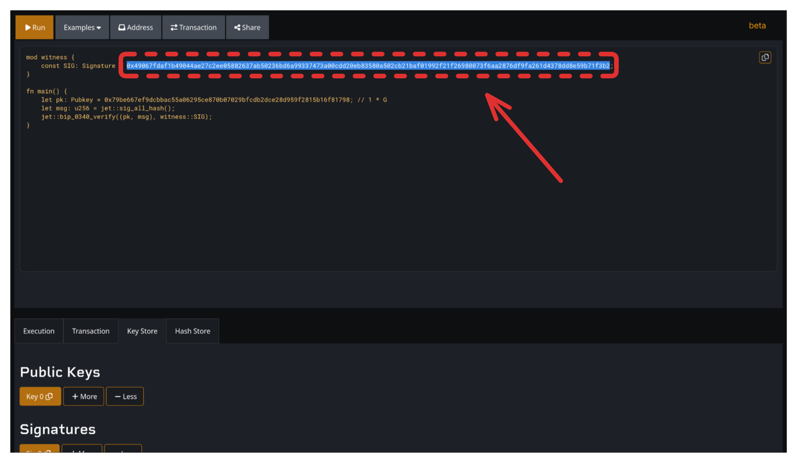

**The complete transaction hex is copied to your clipboard.**

### Step 9: Broadcast Transaction

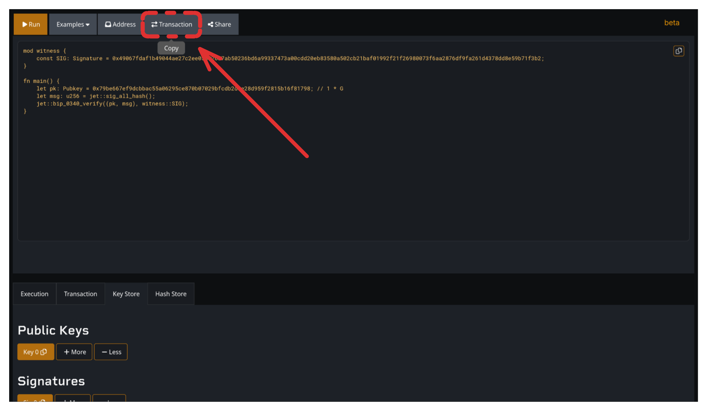

**Copy the transaction hex**, then broadcast via explorer:

**Option A: Blockstream Explorer Broadcast Page**

Navigate to: https://blockstream.info/liquidtestnet/tx/push

Paste your transaction hex and click broadcast.

**Option B: Via curl:**
```bash
curl -X POST "https://blockstream.info/liquidtestnet/api/tx" -d "020000..."
```

Replace `020000...` with your actual transaction hex from the IDE.

### Step 10: Verify on Explorer

View your transaction: https://blockstream.info/liquidtestnet/tx/YOUR_TXID

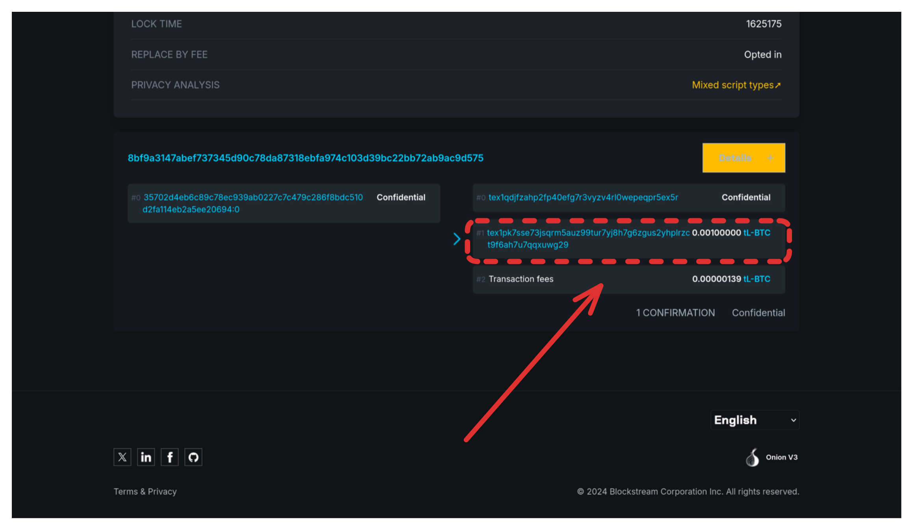

**Check status via API:**
```bash
curl "https://blockstream.info/liquidtestnet/api/tx/<txid>/status"
```

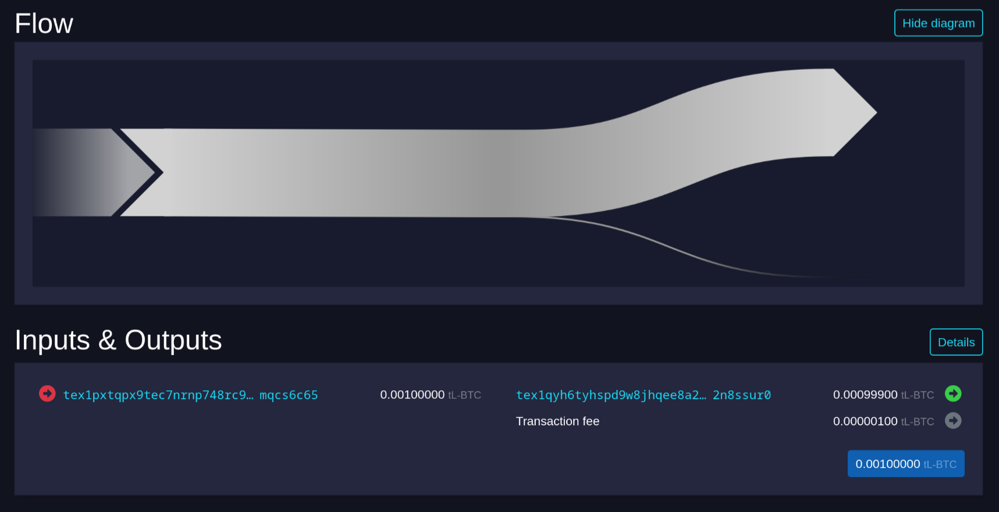

Wait for confirmation (usually 1-2 minutes on Liquid testnet).

**Explorer views:**
- Transaction details: https://blockstream.info/liquidtestnet/tx/TXID
- Address UTXOs: https://blockstream.info/liquidtestnet/address/ADDRESS
- Mempool: https://blockstream.info/liquidtestnet

---

## Common Workflows

### P2PK Contract

**Code:**
```rust
fn main() {
    let pk: Pubkey = 0x02...;
    let msg: u256 = jet::sig_all_hash();
    let sig: Signature = witness::signature;
    jet::bip_0340_verify(pk, msg, sig)
}
```

**Steps:**
1. Compile contract
2. Fund P2TR address
3. Compute sighash (IDE shows this)
4. Sign sighash externally
5. Enter signature in witness field
6. Build and broadcast

### Time-Locked Contract

**Code:**
```rust
fn main() {
    jet::check_lock_time(1735689600);
}
```

**Steps:**
1. Compile and fund
2. Wait until timestamp
3. Build transaction (no special witness)
4. Broadcast after timestamp

---

## Web IDE Internals

### What Happens When You Compile

**Code reference:** [`simplicity-webide/src/compile.rs`](https://github.com/BlockstreamResearch/simplicity-webide)

1. Parse SimplicityHL source
2. Compile to Simplicity
3. Compute CMR
4. Generate P2TR address with internal key:
   ```
   0xf5919fa64ce45f8306849072b26c1bfdd2937e6b81774796ff372bd1eb5362d2
   ```
5. Display results

### Transaction Building

**What the IDE does:**

1. Create transaction structure
2. Build sighash from transaction data + genesis hash
3. Satisfy Simplicity program with witness
4. Encode program and witness to bytes
5. Build complete witness stack
6. Serialize transaction to hex


---

## Troubleshooting

### Compilation Errors

**Error:** `Parameter X is missing an argument`

**Solution:** Provide argument in witness or parameters section

### Transaction Rejected

**Error:** `bad-txns-inputs-missingorspent`

**Solution:** UTXO already spent or doesn't exist. Check:
```bash
curl "https://blockstream.info/liquidtestnet/api/address/tex1p.../utxo"
```

### Signature Invalid

**Error:** Program returns false

**Solution:**
- Verify sighash is correct
- Check signature is BIP-340 Schnorr (64 bytes)
- Ensure public key matches

---

## Limitations

**Web IDE limitations:**
- Testnet only (no mainnet)
- Basic transaction building (single input/output)
- No complex covenant testing
- Browser-based (no local storage)

**For production:** Use CLI tools (simply, elements-cli)

---

## Next Steps

- **Learn SimplicityHL:** [Language Reference](../simplicityhl-reference/)
- **CLI Development:** [Simply CLI Guide](simply-cli-guide.md)
- **Use Cases:** [Example Contracts](../use-cases/)

