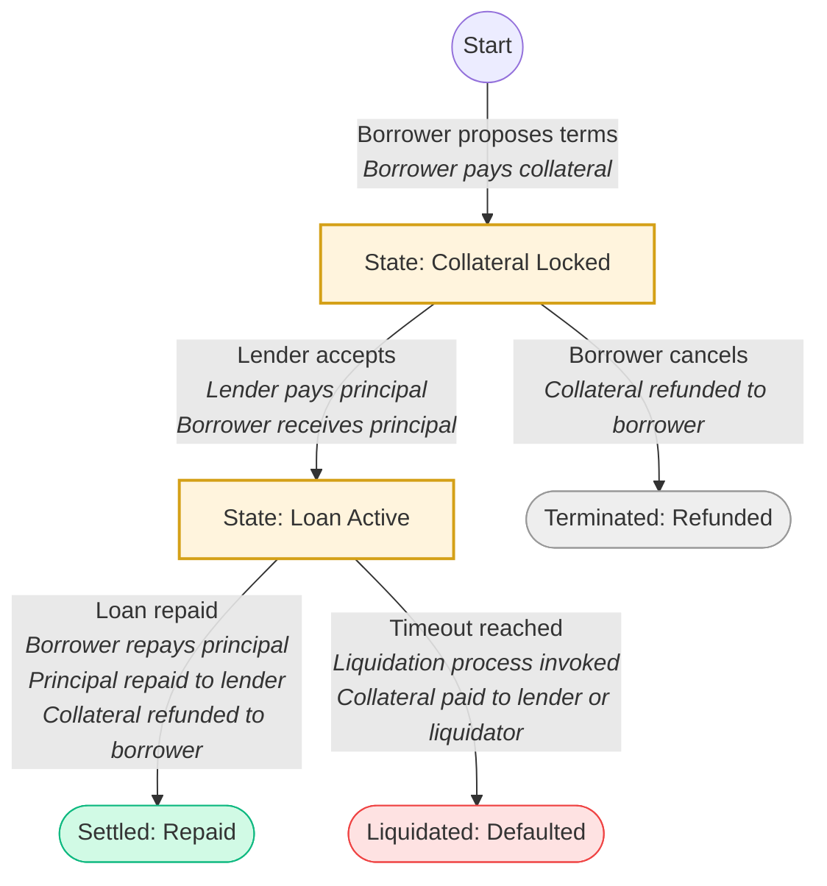

# Simplicity Lending Protocol on Liquid Network

[Simplicity](../glossary.md#simplicity) is a deterministic, statically analyzable smart contract language designed for Bitcoin-like systems, with predictable execution costs and a semantics that lends itself to high assurance reasoning and formal verification. 

This article describes a Simplicity Lending Protocol implemented as Simplicity [smart contracts](../glossary.md#smart-contract) on the [Liquid Network](../glossary.md#liquid). The article focuses on the protocol design, financial logic, and contract decomposition. The Protocol implements on-chain borrowing at interest against collateral, with details agreed and accepted between two parties.

The Protocol can be used by any kind of entity, ranging from a financial institution to a private individual.

The Protocol handles accounting for a loan involving two different tokens, representing different [assets](../glossary.md#asset). For illustrative purposes, we use USDT as a loaned asset and LBTC as a collateral asset, but the protocol handles any pair of assets that are tokenized on Liquid.

The implementation plan consists of steps for the full Protocol implementation. It starts with verified lending primitives and increases the complexity and functionality of the Protocol over time.

The existing implementation can be found [on GitHub](https://github.com/BlockstreamResearch/simplicity-lending).

## Simplicity Lending Protocol Roadmap

### P2P Simplified Lending Contract

These are the parameters of the lending contract:

* **Borrower** - user with collateral asset A.
* **Lender** - user with loan asset B.
* **Collateral Amount** - pledged by Borrower collateral in asset A.
* **Loan Amount** - amount of asset B tokens borrowed by Borrower from Lender.
* **Lending Term** - moment in the future (UNIX time, block number, etc.) before which Borrower should repay the Loan Amount in asset B to the Lender.
* **Loan Amount** - the amount of the loan asset Borrower would like to borrow.
* **Collateral Amount** - locked by the Borrower, the collateral amount for the Loan Amount.
* **Liquidation** - if the Loan is not repaid after the Lending Term, Lender can claim the collateral.
* **Loan Fee** - fixed fee paid in loan asset B from Borrower to Lender for the Loan after the loan is originated. Can represent interest payment for a fixed-term loan.
* **Origination Fee** - fixed fee paid in collateral asset A from Borrower to Lender for the Loan for loan origination.
* **Protocol Fee (Reserve Factor)** - fee paid in loan asset B to the Protocol Address for the Loan after the loan repayment. The fee is calculated as a percentage of the Loan Fee.

#### Loan Origination

##### Borrower to Lender

Borrower locks Collateral Amount and the Origination Fee in the offer transaction. The Borrower also states his parameters in the transaction: the Loan Fee, Lending Term, Origination Fee, and the Loan Amount he would like to borrow. 

After an offer is published with a transaction, any address can accept the offer as a Lender.

##### Lender to Borrower

If the Lender is satisfied with the loan conditions in the offer (Origination Fee, Loan Fee, Protocol Fee, Lending Term, Loan Amount, Collateral Amount), he accepts the offer and sends the Loan Amount, receives a fixed Origination Fee in a transaction and accepts the conditions of the loan, including Origination Fee, Loan Fee, Protocol Fee, Lending Term and Collateral Amount.

The Borrower receives the requested Loan Amount in the offer. 

#### Loan Repayment

The Borrower should fully repay the loan plus the Loan Fee at any moment before the Lending Term. Loan Fee is divided into the Protocol Fee paid to the Protocol Address and the rest paid to the Lender. After the repayment, Borrower can claim back the full amount of the collateral asset.

#### Liquidation

If the Borrower did not repay the full Loan Amount before the Lending Term, the Lender can claim the full collateral amount. 

### P2P Lending Contract with Mock Price Oracle and Partial Loan Repayment

This contract variant is based upon the contract described in the prior section, with additional functionality and an additional Liquidation Loan-To-Value (LLTV) parameter.

Additional definitions:  

* **Price Oracle** - source of constant verified price information of asset A in terms of asset B, signed by a trusted provider. 
* **Third Party Liquidator** - any third party address that can fully repay the loan outstanding at the moment of liquidation and get the Collateral Amount.  
* **Liquidation Protocol Fee** - fee paid to Protocol Address as a percentage (10%, for example) from the Collateral Amount at the liquidation event.

#### Loan Origination

##### Borrower to Lender

Borrower locks Collateral Amount and the Origination Fee in the transaction. The Borrower also states the transaction Loan Fee, Lending Term, Origination Fee, Loan Amount he would like to borrow, which should satisfy the following equation:

$$ \text{Loan Amount} < \text{LLTV} \times \text{Collateral Amount} \times \text{Price Oracle} $$

##### Lender to Borrower

If the Lender is satisfied with the loan conditions in the offer (Origination Fee, Loan Fee, Protocol Fee, Lending Term, Loan Amount, Collateral Amount, and LLTV), he accepts the offer and sends a transaction with the Loan Amount in asset B and receives a fixed Origination Fee.

The Borrower receives the requested Loan Amount in the offer.

#### Loan Repayment

The Borrower should fully repay the Loan Amount plus Loan Fee at any moment before the expiration of the Lending Term. Loan Fee is divided into the Protocol Fee paid to the Protocol Address and the remainder paid to the Lender. After the repayment, Borrower can claim back the full amount of the collateral asset.

During the Lending Term, Borrower can choose a partial loan repayment to avoid a Liquidation event.

#### Liquidation

In case of a default on the loan (if the Borrower did not repay the full Loan Amount plus the Loan Fee before the Lending Term), Lender can claim the full collateral amount for himself. (But see below for a partial liquidation alternative.)

Liquidation at any moment (before or after Lending Term) by a Third Party Liquidator is possible if the following equation is true:

$$ \text{Loan Amount Outstanding} > \text{LLTV} \times \text{Collateral Amount} \times \text{Price Oracle} $$

In this case, Third Party Liquidator receives the Collateral Amount minus the Liquidation Protocol Fee, which goes to the Protocol Address.

#### Partial Liquidation Invariant

The full collateral liquidation option allows the Lender, after the Lending Term, to liquidate the full amount of collateral even if the loan is significantly repaid. To mitigate this case and give the Borrower partial credit for partial repayment, a partial liquidation invariant is available. This alternative pays the Lender a pro-rated fraction of the collateral in exchange for the outstanding portion of the loan principal. The contract also sets a fixed Liquidation Penalty as an additional amount of collateral obtained by the Lender as a penalty for incomplete repayment. The rest of the collateral is sent back to the Borrower.

In this case, liquidation after the Lending Term can be initiated by the Lender or the Borrower. The collateral part received by the Borrower is calculated according to the following equation:

$$ \text{Borrower Collateral Payment} = \text{Collateral Amount} - \frac{\text{Loan Amount Outstanding}}{\text{Price Oracle}} - \text{Liquidation Penalty} $$

Liquidation Penalty is also subject to Liquidation Protocol Fee, which goes to the Protocol Address.

### P2P Lending Contract with Integrated Interest Rate

This contract variant is based upon the contract described in the prior section, but, instead of a fixed Loan Fee, a fixed Interest Rate is used.

Additional definitions:  

* **Interest Rate** - fixed annual percentage rate (APR), which is a reward for the Lender from the Borrower as an incentive to provide the loan.

#### Loan Origination

##### Borrower to Lender

Borrower locks Collateral Amount and the Origination Fee in the transaction. The Borrower also states in the transaction the Interest Rate, Lending Term, Origination Fee, Loan Amount he would like to borrow, which should satisfy the following equation:

$$ \text{Loan Amount} < \text{LLTV} \times \text{Collateral Amount} \times \text{Price Oracle} $$

If the Lender is satisfied with the loan conditions in the offer (Origination Fee, Interest Rate, Protocol Fee, Lending Term, Loan Amount, Collateral Amount), he accepts the offer and sends a transaction with the loan in asset B and receives a fixed Origination Fee.

##### Lender to Borrower

Lender sends the Loan Amount in a transaction and accepts the conditions of the loan, including Origination Fee, Interest Rate, Protocol Fee, Lending Term, Collateral Amount and LLTV.

The Borrower receives the requested Loan Amount in the offer.

#### Loan Repayment

The Borrower should fully repay the Loan Amount with the accrued Interest Rate at any moment before the Lending Term. Loan Fee is divided into the Protocol Fee paid to the Protocol Address and the rest paid to the Lender. After the repayment Borrower can claim back the full amount of the collateral asset.

During the Lending Term Borrower can choose a partial loan repayment to avoid a Liquidation event.

#### Liquidation

If the Borrower did not repay the full Loan Amount plus the accrued Interest Rate before the Lending Term, Lender can claim the full collateral amount for himself. 

Liquidation at any moment (before or after Lending Term) by the Third Party Liquidator is possible provided that the following equation is true:

$$ \text{Loan Amount Outstanding} + \text{Accrued Interest Rate} > \text{LLTV} \times \text{Collateral Amount} \times \text{Price Oracle} $$

Third Party Liquidator receives the Collateral Amount minus the Liquidation Protocol Fee, which goes to the Protocol Address.

#### Partial Liquidation Invariant

The full collateral liquidation option allows the Lender, after the Lending Term, to liquidate the full amount of collateral even if the loan is significantly repaid. To mitigate this case, a partial liquidation mechanism is available. The partial liquidation invariant sets the Liquidation Penalty as a fixed collateral asset amount obtained by the Lender on top of the recovered loan amount. The rest of the collateral is sent back to the Borrower.

In this case, liquidation after the Lending Term can be initiated by the Lender or the Borrower. The collateral part received by Borrower is calculated according to the following equation:

$$ \text{Borrower Collateral Payment} = \text{Collateral Amount} - \frac{\text{Loan Amount Outstanding}}{\text{Price Oracle}} - \text{Liquidation Penalty} $$

Liquidation Penalty is also subject to Liquidation Protocol Fee, which goes to the Protocol Address.

## First Lending Protocol Implementation

For now, we are finalising the first version of the Protocol with a P2P Simplified Lending Contract solution which will be deployed on the Liquid Network and allow lending USDT against LBTC for a fixed term.

The first lending protocol implementation is carried out by multiple [covenants](../glossary.md#covenant) that are constructed continuously by both Borrower and Lender in the following order:

### Creation of Utility Tokens

Both Lender's and Borrower's financial interests in the contract are represented by special "one-time" assets ([tokens](../glossary.md#token)) that enable the existence of secondary markets where these tokens can be sold/traded/exchanged.

To ensure the integrity of lending offer parameters across multiple covenants, specialized Parameter Tokens are utilized. These assets act as data carriers by encoding the protocol parameters directly within their amount fields.

**Important:** To ensure compatibility with Liquid/Elements consensus rules, the encoded value must not exceed the maximum allowed supply limit ([`MAX_MONEY`](https://github.com/ElementsProject/rust-elements/blob/f6ffc7800df14b81c0f5ae1c94368a78b99612b9/src/blind.rs#L471)). This effectively restricts the available data space within the token's amount field to 51 bits.

Two distinct tokens are required to store the current protocol state:

1. `FIRST_PARAMETERS_NFT`: Encodes the `PRINCIPAL_INTEREST_RATE`, `LOAN_DURATION`, `COLLATERAL_DECIMALS_MANTISSA`, and `PRINCIPAL_DECIMALS_MANTISSA`.

    | Bits | Field name | Description |
    | :---- | :---- | :---- |
    | \[0..15\] | Interest Rate | 16-bit value for the loan interest (percentage) |
    | \[16..42\] | Loan Expiration Time | 27-bit value for the loan expiration time in blocks (block height) |
    | \[43..46\] | Collateral Decimals Mantissa | 4-bit exponent for collateral amount calculation |
    | \[47..50\] | Principal Decimals Mantissa | 4-bit exponent for principal amount calculation |

2. `SECOND_PARAMETERS_NFT`: Encodes the `BASE_COLLATERAL_AMOUNT` and `BASE_PRINCIPAL_AMOUNT`.

    | Bits | Field name | Description |
    | :---- | :---- | :---- |
    | \[0..24\] | Base Collateral Amount | 25-bit integer representing the collateral amount without decimals |
    | \[25..49\] | Base Principal Amount | 25-bit integer representing the principal amount without decimals |
    | \[50\] | Free Space | - |

Since the amount in a single UTXO cannot exceed $21,000,000 \times 10^8$, we can reduce the number of bits required to encode the parameters:

- Decimals mantissa (4 bits): This field occupies only 4 bits because assets with more than 8 decimals can't be created on Liquid.  
- Base amount (25 bits): The base amount occupies 25 bits, allowing for a maximum value of 33,554,432. When combined with the decimals mantissa, it can represent any value from 0 up to the maximum possible supply.  
- Interest Rate (16 bits): This field requires a minimum of 14 bits to express percentages using a scale where 10,000 equals 100%. By using 16 bits, we can achieve a maximum interest rate of 655.36%.  
- Loan expiration time in blocks: Setting this value to 27 bits, we allow for the end block of the loan to be 134,217,728. This is currently ~248 years in the future with a 1-minute block rate.

### Lock Collateral

After calculating the Utility asset IDs, the "lock collateral" covenant can be constructed.

### Set up Lending

After the Borrower has constructed a "lock collateral" covenant, a Lender can then initiate the loan by sending the lending covenant transaction.

### Settle Lending

After the lending contract is set up, there are two ways it can be settled. Either the Borrower provides the principal with interest to the Lender and takes the collateral back, or the Lending Term expires, and the Lender liquidates the position, claiming the collateral for himself.

## Indexing and Discovery Mechanism

The indexing mechanism is a critical component of the protocol's UX. To make the lending workflow functional, Lenders must be able to view all active loan offers from Borrowers. Simultaneously, Borrowers require real-time updates on the status of their offers to monitor repayment deadlines and obligations. The following indexing strategy is used to aggregate and display this data.

### Pre-lock Transaction Discovery and Verification

To monitor all active orders, an indexer scans the blockchain to identify transactions that initialize Pre-lock covenants. Once these transactions are identified, an indexer monitors the lifecycle of the resulting UTXOs to extract and update information regarding the loan terms.

An indexer recognizes Pre-lock initialization transactions by matching them against a specific transaction template:

- The transaction must contain a minimum of 5 inputs and 6 outputs.  
- The transaction must include an `OP_RETURN` output containing a valid <a href="https://en.bitcoin.it/wiki/BIP_0340">BIP340</a> public key.  
- The first and second inputs must contain Parameter UTXOs, where the encoded amounts match the bit-packed lending protocol structure.

If a transaction meets the criteria above, the indexer performs a verification:

1. It attempts to compile the Pre-lock covenant using the parameters extracted from the transaction data.  
2. It compares the resulting script hash (CMR) with the script hash of output 0.  
3. If the hashes match, the transaction is confirmed as a valid Pre-lock initialization.

### State Management

An indexer maintains a database of all existing offers. It continuously monitors the blockchain for spending transactions that target protocol-controlled outputs, allowing it to update the status of each loan (e.g., Active, Repaid, Cancelled, or Liquidated) in near real-time.
