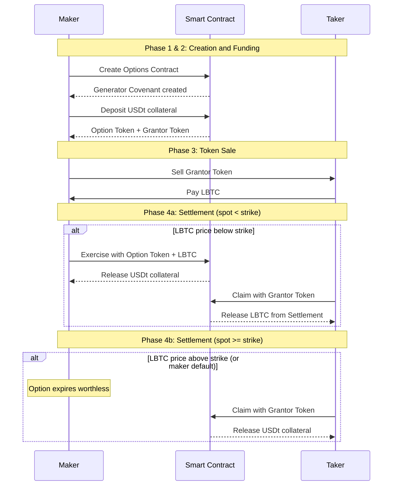

# Simplicity DEX

The underlying code for this project is found in <a href="https://github.com/Blockstream/simplicity-dex">https://github.com/Blockstream/simplicity-dex</a> (other relevant repository links appear below).

Even though we call it a DEX, at its core there is no exchange of Token A for Token B in the traditional sense. The Simplicity DEX is a **structured product marketplace** that enables users to create and trade options contracts on-chain on the Liquid Network. We can also use similar techniques to create a means for advertising and performing direct, immediate exchange of pairs of assets in a decentralized way without an intermediary, but that functionality is planned for future development.

The protocol that we have built facilitates *only* the exchange of "Grantor Tokens" for LBTC tokens. Support for other variations will be added in the future.

The existing code uses Nostr to publicize the existence of contracts and allow a party to locate a counterparty. This document focuses mainly on the financial logic of the contract rather than the technical mechanisms for representating the contract on Nostr and Liquid.

## Core definitions

**Call Option**: A financial contract that gives the holder the right, but not the obligation, to *buy* an underlying asset at a specified strike price before or at a specified expiration date.

**Put Option**: A financial contract that gives the holder the right, but not the obligation, to *sell* an underlying asset at a specified strike price before or at a specified expiration date.

> **Note**: The underlying smart contract supports both Call and Put options, but the current CLI implementation only supports Call options.

**Grantor Token**: A tradable token received by the maker upon funding an options contract. The Grantor Token represents the right to claim assets at settlement - either the LBTC deposited during exercise (if the option is exercised) or the USDt collateral (if the option expires unexercised). The maker in the current version of the protocol sells this token to a taker in exchange for LBTC.

## Implementation

The protocol that we have implemented is a variation of the Call Option. The key difference is that **the premium is effectively paid depending on the exercise outcome**: if the option is exercised, the premium is paid in the claim asset (LBTC); if the option expires unexercised, the premium is paid in the collateral currency (USDt).

### Participants

**Maker ("Option buyer")**: The party that creates the options contract. Upon creation, the maker:

* Deposits USDt collateral into the Collateral Covenant
* Receives both an **Option Token** and a **Grantor Token**
* Keeps the Option Token (gives the right to exercise)
* Sells the Grantor Token to the taker for LBTC

**Taker ("Option seller")**: The party that purchases the Grantor Token and receives the premium in the future. The taker:

* Pays LBTC to acquire the Grantor Token from the maker
* Holds the Grantor Token, which entitles them to claim assets at settlement

### Resources

The core contract of the Simplicity DEX is the Options contract: <https://github.com/BlockstreamResearch/simplicity-contracts/blob/main/crates/contracts/src/options/source_simf/options.simf>

The concept for this contract was proposed in the following whitepaper: <https://blockstream.com/assets/downloads/pdf/options-whitepaper.pdf>

Link to the Simplicity DEX repository: <a href="https://github.com/Blockstream/simplicity-dex">https://github.com/Blockstream/simplicity-dex</a>.

## Financial Incentive

**Maker Profit Condition**: The maker profits when the value of LBTC received (from selling the Grantor Token) exceeds the value of USDt collateral plus the premium they deposited. This occurs when the LBTC price rises significantly above the strike price.

**Taker Profit Condition**: The taker benefits from the guaranteed claim on either LBTC (if the option is exercised) or USDt collateral (if the option expires unexercised). The protocol design ensures the taker always receives the lesser-valued asset, but any maker mistakes only improve the taker's outcome.

 

**Current Limitation**: The taker cannot receive the premium immediately upon purchasing the Grantor Token. A future improvement would be to enable swapping the Grantor Token plus the premium in USD directly for LBTC, allowing the taker to realize their premium gain at the time of the trade rather than waiting for settlement.

## Detailed Step-by-Step Protocol Flow (Current implementation)

The maker selects locked-asset as USDt, and claim-asset as LBTC. The contract size is the collateral, e.g., 115,958 USDt. The strike price is $115,000 (LBTC/USDt). The term length is 30 days. The maker creates the "Options Creation" transaction which produces an Option Token Generator and a Grantor Token Generator held in a Generator Covenant.

The maker funds a single option using the "Option Funding" transaction, which requires depositing 115,958 USDt into the Collateral Covenant. The maker receives an Option Token and a Grantor Token from the Generator Covenant.

Note: at any time, the options contract can be canceled and the collateral retrieved by using both the Option Token and the Grantor Token together to unlock the collateral.

The maker sells their newly minted Grantor Token to the taker for LBTC (an amount less than required to exercise the option) using a standard Liquid atomic swap transaction, and keeps their Option Token.

**Case A: LBTC ends below $115,000.** Just prior to expiration, the maker uses their Option Token to exercise the Collateral Covenant. This requires depositing LBTC into a Settlement Covenant, which in turn unlocks the Collateral Covenant, whose 115,958 USDt funds the maker gets to keep. Afterwards, the taker can use their Grantor Token to retrieve the LBTC from the Settlement Covenant.

**Case B: LBTC ends above $115,000 or the maker lacks adequate LBTC funds.** The maker does nothing and their Option Token is useless. After the expiration date, the taker uses their Grantor Token to retrieve the 115,958 USDt from the Collateral Covenant.

### Key Design Properties

This contract design avoids the need for a price oracle. Instead we simply rely on the Option Token holder's (i.e., the maker's) natural incentives to choose the appropriate outcome. The taker is required to get the lesser-valued asset of the two, after the expiration date. The choices the maker can make can only improve the taker's outcome. The maker could incorrectly exercise or not exercise their option, which will cause the taker to end up with the more-valuable asset, or the maker could incorrectly exercise their option early, allowing the taker to get access to their funds prior to the expiration date, or both.

*It is the responsibility of the maker to optimize their handling of the options* in order to extract the most value for themselves. Any other outcome can only benefit the taker.

By avoiding the price oracle, we also automatically handle the case where the maker defaults. In this case, the taker gets the USDt collateral, regardless of the LBTC price.

Our options design includes extra features that go beyond the basic specification. In particular, our Grantor and Option Tokens are real tradable assets, and both can be resold. This is particularly useful for the maker in the case that they are in default (i.e., does not have sufficient funds to exercise the option), but otherwise the option is in-the-money. In such a case, the maker can sell their Option Token to someone else who does have sufficient funds to exercise the option.

The design also allows for more than one pair of Grantor/Option Tokens to be generated. For example, the maker can generate 10 token pairs along with 10 Collateral Covenant UTXOs, each holding one tenth of the total collateral. This enables partially filling the order. These sets of Option Tokens and Grantor Tokens are fungible and tradeable. Unfilled orders (i.e., when not all the Grantor Tokens are sold) can be used, along with the same number of Option Tokens, to cancel unused Collateral Covenants and recover the funds immediately.

#### Appendix A — Excalidraw file

[profit-loss-diagram(2).excalidraw 28916](/assets/9e9ecabd-7792-4970-a69c-28847b5e9c99.false)

## Appendix B: Mapping to Traditional Options Positions

The Options contract is flexible enough to create all four standard options positions depending on two parameters: the collateral type and which token the maker sells.

However, the current contract configuration forces the premium to be of the collateral type, not in USD.

 

### The Two Determining Factors

**Collateral type determines Call vs Put:**

* **USDt collateral** → Call-like structure (the option is fundamentally about acquiring LBTC)
* **LBTC collateral** → Put-like structure (the option is fundamentally about acquiring USDt)

**Which token is sold determines who holds the Long vs Short position:**

* **Sell Grantor Token** (keep Option Token) → Maker holds the "long" position (has the right to exercise)
* **Sell Option Token** (keep Grantor Token) → Taker holds the "long" position (has the right to exercise)

### The Four Configurations

| Configuration | Collateral | Token Sold | Maker's Position | Taker's Position |
|----|----|----|----|----|
| 1 | USDt | Grantor | Long Call | Short Call |
| 2 | USDt | Option | Short Call | Long Call |
| 3 | LBTC | Grantor | Long Put | Short Put |
| 4 | LBTC | Option | Short Put | Long Put |

**Configuration 1 (USDt collateral, sell Grantor)** is the current implementation described in this document. The maker profits when LBTC rises significantly (Long Call profile), while the taker has limited upside but collects the premium spread (Short Call profile).

**Configuration 2 (USDt collateral, sell Option)** flips the positions. The taker, now holding the Option Token, has the right to exercise and profits when LBTC falls (Long Call on USDt, effectively). The maker keeps the Grantor Token and has the Short Call profile.

**Configuration 3 (LBTC collateral, sell Grantor)** creates a Put-like structure. The maker deposits LBTC as collateral. The Option Token holder can deposit USDt to claim the LBTC. The maker (holding Option Token) profits when LBTC falls (Long Put profile).

**Configuration 4 (LBTC collateral, sell Option)** is the inverse of Configuration 3. The taker holds the Option Token and has the Long Put position, profiting when LBTC falls. The maker has the Short Put profile.

### Practical Implications

This flexibility means market participants can use the same underlying contract to express different market views:

* **Bullish on LBTC**: Use Configuration 1 (maker) or Configuration 4 (taker)
* **Bearish on LBTC**: Use Configuration 3 (maker) or Configuration 2 (taker)
* **Neutral/yield-seeking**: Take the "short" side of any configuration to collect premium

The current CLI implementation supports Configuration 1, but the underlying smart contract is capable of supporting all four configurations.
